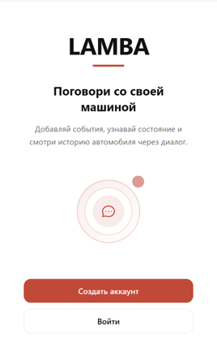
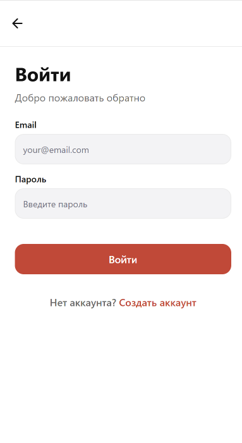
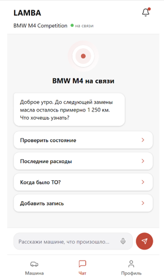
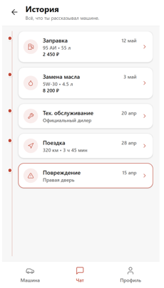
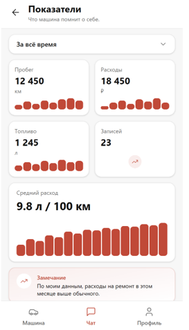

# Week 2 Repository Index

## Project

- Project name: `LAMBA`
- Short description: mobile app and backend for creating a digital twin of a vehicle, including vehicle history, chat-based interaction, and MVP integration through Android -> FastAPI -> PostgreSQL.
- Root repository overview: [README.md](../../README.md)
- License: [LICENSE](../../LICENSE)

## Required Week 2 Files

- User stories: [user-stories.md](./user-stories.md)
- MVP v0 report: [mvp-v0-report.md](./mvp-v0-report.md)
- Customer meeting summary: [customer-meeting-summary.md](./customer-meeting-summary.md)
- Customer transcript / published notes: [customer-meeting-transcript.md](./customer-meeting-transcript.md)
- Week 2 analysis: [analysis.md](./analysis.md)
- LLM report: [llm-report.md](./llm-report.md)

## Prototype And Interface Artifacts

### Selected graphical interface artifacts

Repository screenshots used as the published Week 2 interface evidence:

- Welcome screen: [welcom-screen.png](./images/welcom-screen.png)
- Registration screen: [registration-screen.png](./images/registration-screen.png)
- Login screen: [login-screen.png](./images/login-screen.png)
- Vehicle screen: [vehicle-screen.png](./images/vehicle-screen.png)
- Add vehicle screen: [add-vehicle-screen.png](./images/add-vehicle-screen.png)
- Save vehicle screen: [save-vehicle-screen.png](./images/save-vehicle-screen.png)
- Chat screen: [Chat-screen.png](./images/Chat-screen.png)
- Timeline screen: [timeline-screen.png](./images/timeline-screen.png)
- Statistics screen: [statistics-screen.png](./images/statistics-screen.png)
- Profile screen: [profile-screen.png](./images/profile-screen.png)
- Save notes screen: [save-notes.png](./images/save-notes.png)

Public interactive prototype link:

- No public view-only prototype URL is committed in the repository as of June 14, 2026.

### Selected API interface artifacts

- API contract used as the public repository specification: [docs/api-contract.md](../../docs/api-contract.md)
- Swagger UI when the backend is running locally: [http://localhost:8000/docs](http://localhost:8000/docs)
- OpenAPI JSON when the backend is running locally: [http://localhost:8000/openapi.json](http://localhost:8000/openapi.json)
- Accessible local implementation / mock entry point: [http://localhost:8000](http://localhost:8000)
- Runnable backend artifact: [docker-compose.yml](../../docker-compose.yml)
- Public Postman collection: no Postman collection is currently published in the repository.

## MVP v0 Access

- MVP v0 report: [mvp-v0-report.md](./mvp-v0-report.md)
- Runnable artifact: [docker-compose.yml](../../docker-compose.yml)
- Run instructions: [root README local setup](../../README.md#local-setup)
- API contract for MVP integration: [docs/api-contract.md](../../docs/api-contract.md)
- Deployed MVP v0 backend URL: [http://10.93.26.193:8000](http://10.93.26.193:8000)
- Deployed health check: [http://10.93.26.193:8000/health](http://10.93.26.193:8000/health)
- Deployed Swagger UI: [http://10.93.26.193:8000/docs](http://10.93.26.193:8000/docs)
- Public video demonstration: TODO, add the public video link after `@lisa_va_si` records the integration demo.

## PR / MR Process Evidence

- PR template: [.github/pull_request_template.md](../../.github/pull_request_template.md)
- Reviewed PR example: [PR #14 - feat: connected backend and frontend via POST /auth/login](https://github.com/LAMBA-23/LAMBA/pull/14)
- Reviewed PR example: [PR #15 - Add files via upload](https://github.com/LAMBA-23/LAMBA/pull/15)
- Reviewed PR example: [PR #18 - docs: add customer transcript and llm usage report](https://github.com/LAMBA-23/LAMBA/pull/18)

## Link Checking

- Lychee workflow: [.github/workflows/lychee.yml](../../.github/workflows/lychee.yml)
- Lychee configuration: [lychee.toml](../../lychee.toml)
- Latest successful protected-default-branch run on `main`: [Link Check #24](https://github.com/LAMBA-23/LAMBA/actions/runs/27503163826)

### Lychee exclusions

Current exclusions configured in [lychee.toml](../../lychee.toml):

- `http://localhost:.*`
- `http://127.0.0.1:.*`
- `http://10.93.26.193:.*`

Justification:

- these are local development URLs that are valid for repository setup and testing instructions but are not reachable from GitHub Actions runners
- `localhost` is required for backend run instructions, Swagger UI, and API smoke-check examples
- `127.0.0.1` is excluded for the same local-only reason, even when not currently used in Week 2 markdown files
- `10.93.26.193` is the university VM address for the deployed MVP v0 backend; it is reachable from the university network but may not be reachable from GitHub Actions runners

Manual verification status:

- local links are intended only for local execution and must be checked in a browser on the machine running the backend before final submission
- the university VM links were manually checked on June 14, 2026: `/health` returned `{"status":"ok"}` and `/docs` opened Swagger UI

Additional note:

- `http://10.0.2.2:8000/` is used by the Android emulator configuration in source code, but it is not currently listed in `lychee.toml` because it is not used as a markdown link in the published Week 2 report files

## Screenshots

### Selected prototype and interface artifacts

### Required screenshot evidence not yet committed as dedicated PNG files

- Protected default branch settings screenshot: not yet present under `reports/week2/images/`
- Reviewed PR screenshot with another team member's review: not yet present under `reports/week2/images/`
- Runnable artifact / deployed MVP screenshot: not yet present under `reports/week2/images/`; deployed URL and smoke-check are documented in [mvp-v0-report.md](./mvp-v0-report.md)

## Coverage

Stable user-story IDs selected for the initial MVP scope in [user-stories.md](./user-stories.md): `US-01`, `US-02`, `US-03`, `US-04`, `US-05`.

Prototype and interface coverage represented by the published Week 2 artifacts:

- `US-01` User registration: represented by [registration-screen.png](./images/registration-screen.png) and [login-screen.png](./images/login-screen.png)
- `US-02` Add a vehicle: represented by [vehicle-screen.png](./images/vehicle-screen.png), [add-vehicle-screen.png](./images/add-vehicle-screen.png), and [save-vehicle-screen.png](./images/save-vehicle-screen.png)
- `US-03` Send messages: represented by [Chat-screen.png](./images/Chat-screen.png)
- `US-04` Automatically create records: represented by [save-notes.png](./images/save-notes.png) as the event/record capture concept
- `US-05` View vehicle timeline: represented by [timeline-screen.png](./images/timeline-screen.png)
- `US-07` View basic statistics: represented by [statistics-screen.png](./images/statistics-screen.png)
- `US-06` Ask AI assistant: partially represented by [Chat-screen.png](./images/Chat-screen.png) as the conversational interface

MVP v0 foundation coverage:

- [mvp-v0-report.md](./mvp-v0-report.md) documents the deployed backend URL, repeatable smoke-check scenario, and the technical foundation `Android / API client -> FastAPI -> PostgreSQL`
- `US-01` is represented by the demo login flow and backend `POST /auth/login` foundation, even though full production authentication is not in scope
- `US-03` is represented by the chat screen prototype; backend AI/chat behavior is not part of the current deployed MVP v0 foundation
- `US-04` is represented by the save-event flow through backend persistence
- `US-05` is represented by the history / timeline flow in the smoke-check scenario
- `US-07` is represented by statistics updates after saving an event
- `US-02` is partially represented by the single-vehicle MVP data model and vehicle endpoint foundation

## Customer Materials

- Published customer transcript / notes: [customer-meeting-transcript.md](./customer-meeting-transcript.md)
- Customer meeting summary: [customer-meeting-summary.md](./customer-meeting-summary.md)

## Analysis And AI Usage

- Week 2 analysis: [analysis.md](./analysis.md)
- Week 2 LLM report: [llm-report.md](./llm-report.md)
