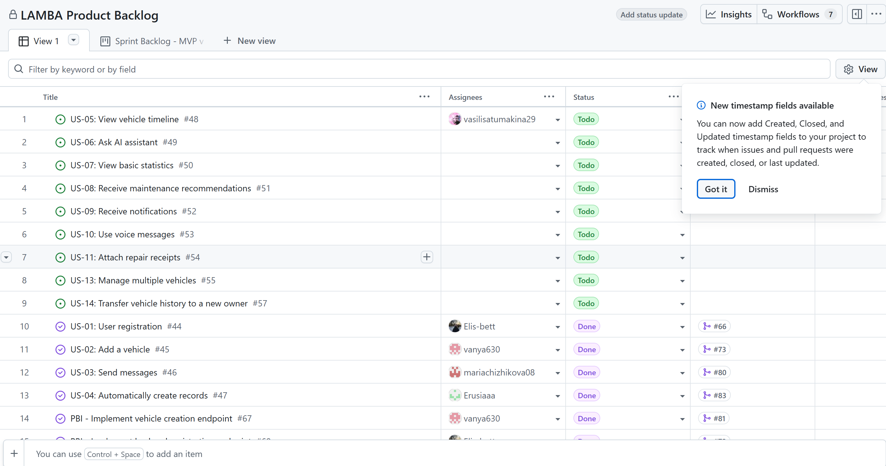
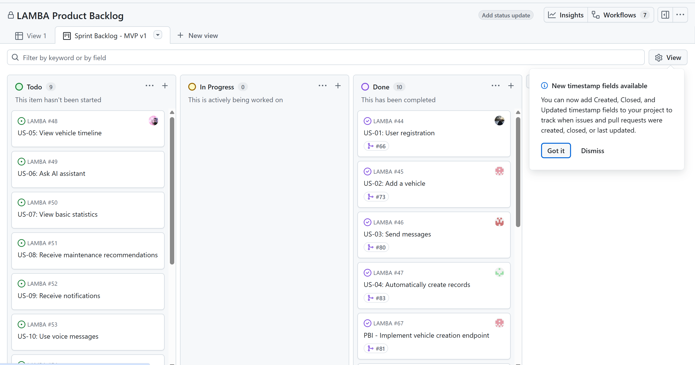
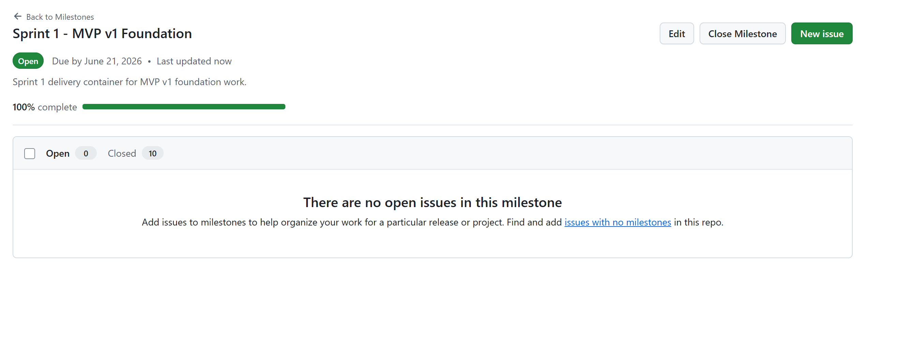
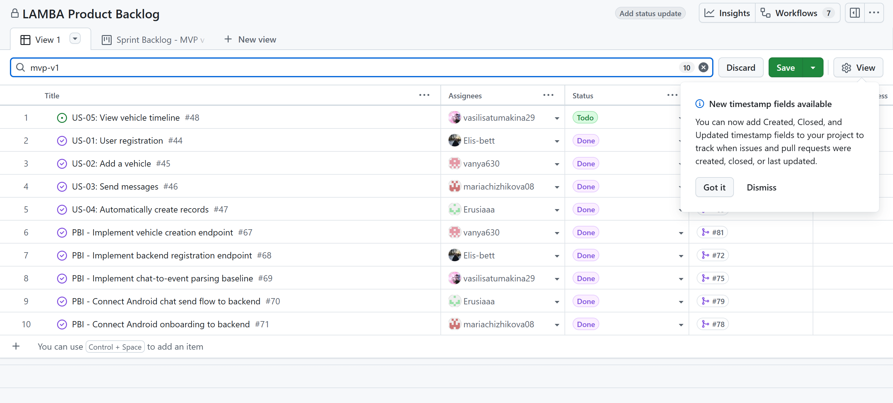
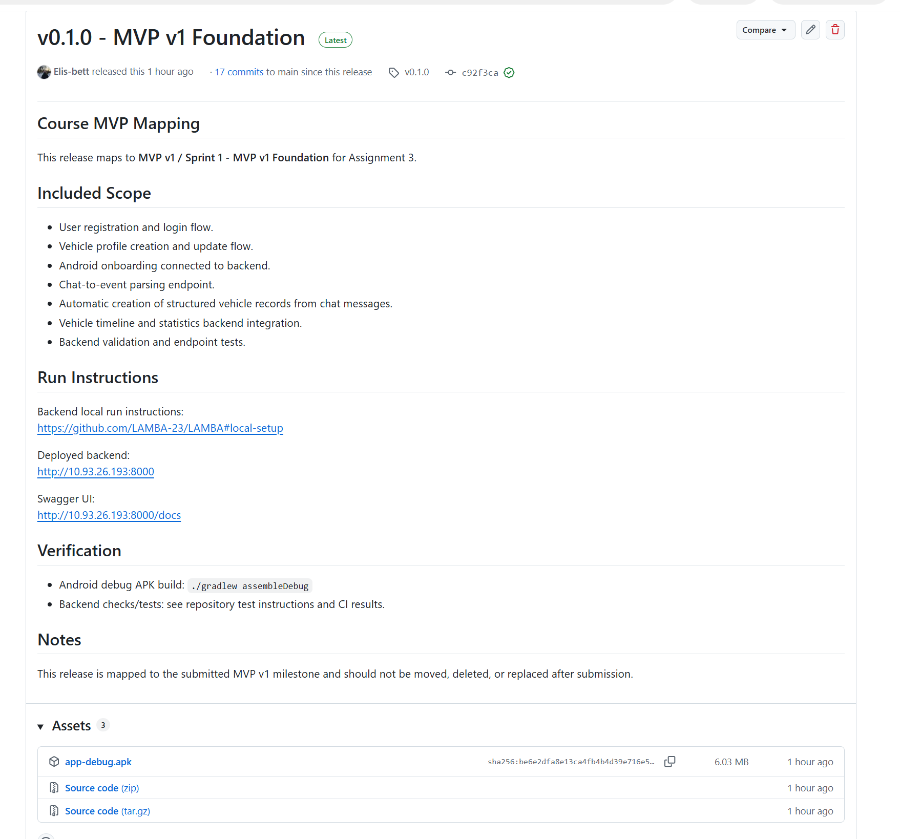
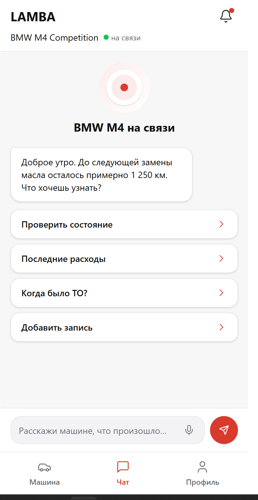
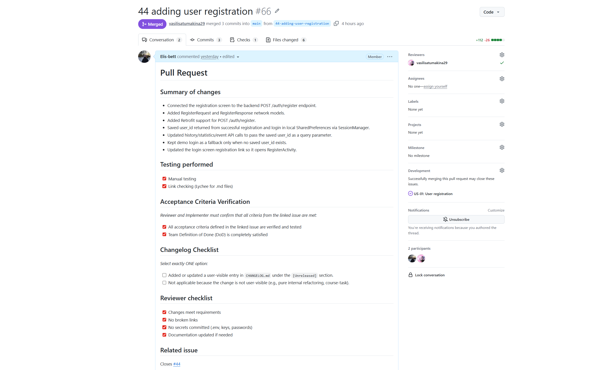

# Week 3 Report — LAMBA MVP v1

This is the canonical public Week 3 report and submission index for Assignment 3. Status was checked on 21 June 2026.

## 1. Project name, description, and license

**LAMBA** is an Android application for creating a digital twin of a car. Its planned product flow covers a vehicle profile, chat-based vehicle event recording, and vehicle history.

- [Root LICENSE](../../LICENSE)

## 2. Current user-story and PBI scope since Assignment 2

Assignment 2 established 14 stable user-story IDs in [reports/week2/user-stories.md](../week2/user-stories.md): US-01 through US-11 were active and estimated candidates, US-12 was retained as a removed requirement, and US-13 and US-14 were active but marked *Won't Have*. The proposed MVP v1 scope was US-01 through US-05.

During Week 3, the team kept that stable user-story membership but migrated the authoritative current registry to [docs/user-stories.md](../../docs/user-stories.md). This file is the stable catalogue of user-story IDs, titles, requirement status, and issue links. The Product Backlog board is intended to provide the live planning view, including priority, status, estimates, MVP version, and Sprint assignment. Each linked GitHub issue contains the detailed description, acceptance criteria, ownership, implementation discussion, and change history.

For Sprint 1, the selected scope remained US-01 through US-05. The team also decomposed the work into five supporting technical PBIs: vehicle creation endpoint (#67), backend registration endpoint (#68), chat-to-event parser (#69), Android chat/backend integration (#70), and Android onboarding/backend integration (#71). At the Week 3 cutoff, all five supporting PBIs were closed. US-01, US-02, US-03, and US-04 were closed; US-05 remained open and was not completed by the deadline.

| Current Sprint story | Current state and history | Supporting PBI history |
| --- | --- | --- |
| US-01 — User registration | [#44](https://github.com/LAMBA-23/LAMBA/issues/44) — completed | [#68](https://github.com/LAMBA-23/LAMBA/issues/68) — backend registration endpoint |
| US-02 — Add a vehicle | [#45](https://github.com/LAMBA-23/LAMBA/issues/45) — completed | [#67](https://github.com/LAMBA-23/LAMBA/issues/67) — vehicle creation endpoint |
| US-03 — Send messages | [#46](https://github.com/LAMBA-23/LAMBA/issues/46) — completed | [#70](https://github.com/LAMBA-23/LAMBA/issues/70) — Android chat/backend flow |
| US-04 — Automatically create records | [#47](https://github.com/LAMBA-23/LAMBA/issues/47) — completed | [#69](https://github.com/LAMBA-23/LAMBA/issues/69) — parser; [#70](https://github.com/LAMBA-23/LAMBA/issues/70) — persistence flow |
| US-05 — View vehicle timeline | [#48](https://github.com/LAMBA-23/LAMBA/issues/48) — not completed by the deadline | No completed dedicated supporting PBI |

Therefore, the current Week 3 scope is not a new set of user stories: it is the issue-linked, estimated, Sprint-assigned implementation of the MVP v1 subset selected in Assignment 2, with US-05 carried forward as unfinished work.

## 3. Assignment 2 customer feedback addressed in MVP v1

The customer feedback used for Week 3 refinement is documented in the [customer review summary](customer-review-summary.md). The following requested or approved points were addressed in the delivered increment:

| Customer feedback point | How it was addressed | Evidence |
| --- | --- | --- |
| Registration should use login and password and should be backed by real backend logic. | Android registration was connected to `POST /auth/register`; the backend persists new users and supports later login. | [#44](https://github.com/LAMBA-23/LAMBA/issues/44), [#68](https://github.com/LAMBA-23/LAMBA/issues/68), [PR #66](https://github.com/LAMBA-23/LAMBA/pull/66), [PR #72](https://github.com/LAMBA-23/LAMBA/pull/72) |
| One user may have one vehicle in MVP v1. | The backend and Android flow create or update a single vehicle profile associated with the selected user. | [#45](https://github.com/LAMBA-23/LAMBA/issues/45), [#67](https://github.com/LAMBA-23/LAMBA/issues/67), [PR #73](https://github.com/LAMBA-23/LAMBA/pull/73), [PR #81](https://github.com/LAMBA-23/LAMBA/pull/81) |
| Vehicle brand and model may be entered manually; a model database is not required. | The Android vehicle form and backend endpoint accept validated text values for brand and model, plus year and mileage. | [PR #73](https://github.com/LAMBA-23/LAMBA/pull/73), [PR #81](https://github.com/LAMBA-23/LAMBA/pull/81) |
| Registration, login, and vehicle setup should form one working onboarding flow. | Android onboarding routes between registration/login, vehicle lookup/setup, and the main application using backend responses. | [#71](https://github.com/LAMBA-23/LAMBA/issues/71), [PR #78](https://github.com/LAMBA-23/LAMBA/pull/78) |
| Basic chat should be included in MVP v1. | The chat blocks empty input, displays user and assistant messages, and sends supported messages through the backend flow. | [#46](https://github.com/LAMBA-23/LAMBA/issues/46), [PR #79](https://github.com/LAMBA-23/LAMBA/pull/79), [PR #80](https://github.com/LAMBA-23/LAMBA/pull/80) |
| Supported vehicle events should be extracted from chat, with clarification when data is ambiguous. | The parser handles supported Russian messages, returns structured data, requests clarification when needed, and saves valid events for the logged-in user. | [#47](https://github.com/LAMBA-23/LAMBA/issues/47), [#69](https://github.com/LAMBA-23/LAMBA/issues/69), [#70](https://github.com/LAMBA-23/LAMBA/issues/70), [PR #75](https://github.com/LAMBA-23/LAMBA/pull/75), [PR #79](https://github.com/LAMBA-23/LAMBA/pull/79), [PR #83](https://github.com/LAMBA-23/LAMBA/pull/83) |

## 4. Historical Week 2 user stories

- [reports/week2/user-stories.md](../week2/user-stories.md)

## 5. Current user stories

- [docs/user-stories.md](../../docs/user-stories.md)

## 6. Product Backlog view

- [Product Backlog view](https://github.com/LAMBA-23/LAMBA/issues?q=is%3Aissue%20label%3Apbi)

## 7. Current Sprint Backlog view

- [Current Sprint Backlog view](https://github.com/LAMBA-23/LAMBA/issues?q=is%3Aissue%20label%3Apbi%20milestone%3A%22Sprint%201%20-%20MVP%20v1%20Foundation%22)

## 8. Current Sprint milestone

- [Sprint 1 — MVP v1 Foundation](https://github.com/LAMBA-23/LAMBA/milestone/1)

This milestone is the authoritative source for the Sprint Goal, Sprint dates, and current Sprint scope.

## 9. Total Product Backlog size in Story Points

The Product Backlog size is **119 Story Points**:

- active estimated user stories: `5 + 5 + 5 + 13 + 8 + 5 + 3 + 13 + 8 + 13 + 13 = 91` Story Points;
- estimated supporting PBIs: `#67 5 + #68 5 + #69 8 + #70 5 + #71 5 = 28` Story Points.

Total: `91 + 28 = 119` Story Points. Stories marked *Won't Have* or *Removed*, course tasks, and [#64](https://github.com/LAMBA-23/LAMBA/issues/64), which has no estimate, are not counted.

## 10. Total current Sprint size in Story Points

The current Sprint size is **64 Story Points**:

- selected user stories: `5 + 5 + 5 + 13 + 8 = 36` Story Points;
- supporting PBIs: `5 + 5 + 8 + 5 + 5 = 28` Story Points.

Total: `36 + 28 = 64` Story Points. [#64](https://github.com/LAMBA-23/LAMBA/issues/64) has no estimate and is not counted.

## 11. MVP v1 scope view

- [MVP v1 filtered issue view](https://github.com/LAMBA-23/LAMBA/issues?q=is%3Aissue%20label%3Amvp-v1)

## 12. Selected MVP v1 scope

The selected MVP v1 scope was the smallest end-to-end product flow agreed for Sprint 1:

- a new user can register and an existing user can log in ([US-01 #44](https://github.com/LAMBA-23/LAMBA/issues/44));
- the user can create or update one vehicle profile with brand, model, production year, and mileage ([US-02 #45](https://github.com/LAMBA-23/LAMBA/issues/45));
- the user can send non-empty text messages and see assistant responses ([US-03 #46](https://github.com/LAMBA-23/LAMBA/issues/46));
- supported messages can be parsed into structured refueling, repair, trip, issue, or technical-condition records and stored for the user ([US-04 #47](https://github.com/LAMBA-23/LAMBA/issues/47));
- the user should be able to view saved records in a chronological vehicle timeline ([US-05 #48](https://github.com/LAMBA-23/LAMBA/issues/48)).

The first four stories were delivered. US-05 was selected but was not completed by the Week 3 deadline and is not claimed as part of the delivered increment.

## 13. PBI and workflow conventions

- **PBI types:** the User Story template is used for user-valued requirements with stable `US-xx` IDs. The Other PBI template covers Technical, Infrastructure, Design, Testing, Deployment, Documentation, Research, and Other product work. Reproducible defects use the Bug Report template and carry the `pbi` label. Course Tasks are explicitly not PBIs and do not count toward backlog size.
- **Requirement status:** User Stories use `Active` or `Removed` to preserve requirement membership and history independently of implementation progress.
- **Work status:** use the canonical values from `Process_Requirements.md`: `To Do`, `Ready`, `In Progress`, `Review`, and `Done`.
- **Priorities:** all PBI templates use MoSCoW values: `Must Have`, `Should Have`, `Could Have`, and `Won't Have`.
- **Estimation:** the Other PBI template names the Modified Fibonacci values `1, 2, 3, 5, 8, 13, 20, 40, 100`, plus `TBD`; the User Story template requests the same values.
- **Sprint milestone usage:** selected Sprint work is assigned to the Sprint milestone. The milestone is authoritative for the Sprint Goal, dates, and scope; the report links to it instead of duplicating those values.
- **MVP version tracking:** the templates store MVP membership in the issue's `MVP version` field, using values such as `MVP v1`, `Not selected for MVP v1`, and `Not planned`.
- **Task decomposition:** user stories describe user outcomes. Supporting PBIs split a story across backend endpoints, Android screens and repositories, parsing, persistence, testing, deployment, or documentation. Each implementation change is delivered through an issue-linked PR, and completion evidence is recorded in the issue or PR.

- [Process_Requirements.md](../../Process_Requirements.md)

## 14. Roadmap direction

The current Sprint direction was to establish the MVP v1 foundation: registration, one-vehicle onboarding, basic chat, structured event recording, and timeline visibility. Registration, onboarding, chat, and event recording were delivered; timeline visibility remains unfinished under US-05.

The next planned Sprint direction is to use the stored vehicle history for answers and simple aggregates through [US-06 #49 — Ask AI assistant](https://github.com/LAMBA-23/LAMBA/issues/49) and [US-07 #50 — View basic statistics](https://github.com/LAMBA-23/LAMBA/issues/50). The unfinished US-05 work must be completed before those stories depend on the timeline foundation.

- [docs/roadmap.md](../../docs/roadmap.md)

## 15. Verification evidence for completed MVP v1 PBIs

| Completed scope | Issue | Reviewed PR and verification evidence |
| --- | --- | --- |
| User registration | [#44](https://github.com/LAMBA-23/LAMBA/issues/44) | [PR #66](https://github.com/LAMBA-23/LAMBA/pull/66) |
| Vehicle profile | [#45](https://github.com/LAMBA-23/LAMBA/issues/45) | [PR #73](https://github.com/LAMBA-23/LAMBA/pull/73) |
| Basic chat sending | [#46](https://github.com/LAMBA-23/LAMBA/issues/46) | [PR #80](https://github.com/LAMBA-23/LAMBA/pull/80) |
| Automatic structured records | [#47](https://github.com/LAMBA-23/LAMBA/issues/47) | [PR #83](https://github.com/LAMBA-23/LAMBA/pull/83), including 9 passing backend US-04 tests |
| Vehicle creation endpoint | [#67](https://github.com/LAMBA-23/LAMBA/issues/67) | [PR #81](https://github.com/LAMBA-23/LAMBA/pull/81), including 15 passing backend tests |
| Backend registration endpoint | [#68](https://github.com/LAMBA-23/LAMBA/issues/68) | [PR #72](https://github.com/LAMBA-23/LAMBA/pull/72) |
| Chat-to-event parser | [#69](https://github.com/LAMBA-23/LAMBA/issues/69) | [PR #75](https://github.com/LAMBA-23/LAMBA/pull/75) |
| Android chat/backend flow | [#70](https://github.com/LAMBA-23/LAMBA/issues/70) | [PR #79](https://github.com/LAMBA-23/LAMBA/pull/79), including 5 passing unit tests |
| Android onboarding/backend flow | [#71](https://github.com/LAMBA-23/LAMBA/issues/71) | [PR #78](https://github.com/LAMBA-23/LAMBA/pull/78) |

US-05 is absent because it was not completed.

## 16. Current product status

At the Week 3 cutoff, the Android and backend code support registration, login, one-vehicle setup, basic text chat, chat-to-event parsing, clarification responses, and persistence of supported events for the selected user. The implementation is represented by closed US-01, US-02, US-03, and US-04 and their reviewed PRs.

The product is a partial MVP v1 increment rather than the complete selected MVP v1 scope because US-05 remains open. The report does not claim that the chronological timeline, refresh behavior, and empty-state behavior required by US-05 were delivered by the deadline.

## 17. Next steps

The next product step is to complete, review, and verify [US-05 #48 — View vehicle timeline](https://github.com/LAMBA-23/LAMBA/issues/48). Completion must cover the acceptance criteria recorded in the issue: chronological display of saved records, visibility of newly created records after opening or refreshing the timeline, and an empty state when no records exist.

## 18. Contribution traceability

| Team member | Issues | PRs | Review activity |
| --- | --- | --- | --- |
| [Elis-bett](https://github.com/Elis-bett) | [#44](https://github.com/LAMBA-23/LAMBA/issues/44), [#68](https://github.com/LAMBA-23/LAMBA/issues/68), [#88](https://github.com/LAMBA-23/LAMBA/issues/88), [#98](https://github.com/LAMBA-23/LAMBA/issues/98) | [#66](https://github.com/LAMBA-23/LAMBA/pull/66), [#72](https://github.com/LAMBA-23/LAMBA/pull/72), [#90](https://github.com/LAMBA-23/LAMBA/pull/90), [#100](https://github.com/LAMBA-23/LAMBA/pull/100), [#106](https://github.com/LAMBA-23/LAMBA/pull/106) | Approved [#73](https://github.com/LAMBA-23/LAMBA/pull/73), [#77](https://github.com/LAMBA-23/LAMBA/pull/77), [#81](https://github.com/LAMBA-23/LAMBA/pull/81), [#85](https://github.com/LAMBA-23/LAMBA/pull/85), [#91](https://github.com/LAMBA-23/LAMBA/pull/91), and [#99](https://github.com/LAMBA-23/LAMBA/pull/99) |
| [vanya630](https://github.com/vanya630) | [#45](https://github.com/LAMBA-23/LAMBA/issues/45), [#64](https://github.com/LAMBA-23/LAMBA/issues/64), [#67](https://github.com/LAMBA-23/LAMBA/issues/67), [#94](https://github.com/LAMBA-23/LAMBA/issues/94) | [#63](https://github.com/LAMBA-23/LAMBA/pull/63), [#65](https://github.com/LAMBA-23/LAMBA/pull/65), [#73](https://github.com/LAMBA-23/LAMBA/pull/73), [#81](https://github.com/LAMBA-23/LAMBA/pull/81), [#82](https://github.com/LAMBA-23/LAMBA/pull/82) | Approved [#75](https://github.com/LAMBA-23/LAMBA/pull/75), [#87](https://github.com/LAMBA-23/LAMBA/pull/87), and [#102](https://github.com/LAMBA-23/LAMBA/pull/102) |
| [mariachizhikova08](https://github.com/mariachizhikova08) | [#46](https://github.com/LAMBA-23/LAMBA/issues/46), [#71](https://github.com/LAMBA-23/LAMBA/issues/71) | [#78](https://github.com/LAMBA-23/LAMBA/pull/78), [#80](https://github.com/LAMBA-23/LAMBA/pull/80) | Approved [#79](https://github.com/LAMBA-23/LAMBA/pull/79) and [#83](https://github.com/LAMBA-23/LAMBA/pull/83) |
| [Erusiaaa](https://github.com/Erusiaaa) | [#47](https://github.com/LAMBA-23/LAMBA/issues/47), [#70](https://github.com/LAMBA-23/LAMBA/issues/70) | [#79](https://github.com/LAMBA-23/LAMBA/pull/79), [#83](https://github.com/LAMBA-23/LAMBA/pull/83) | Requested changes and later approved [#78](https://github.com/LAMBA-23/LAMBA/pull/78); approved [#80](https://github.com/LAMBA-23/LAMBA/pull/80) |
| [vasilisatumakina29](https://github.com/vasilisatumakina29) | [#48](https://github.com/LAMBA-23/LAMBA/issues/48) (unfinished at the deadline), [#69](https://github.com/LAMBA-23/LAMBA/issues/69), [#76](https://github.com/LAMBA-23/LAMBA/issues/76), [#84](https://github.com/LAMBA-23/LAMBA/issues/84), [#86](https://github.com/LAMBA-23/LAMBA/issues/86), [#89](https://github.com/LAMBA-23/LAMBA/issues/89), [#97](https://github.com/LAMBA-23/LAMBA/issues/97), [#101](https://github.com/LAMBA-23/LAMBA/issues/101), [#104](https://github.com/LAMBA-23/LAMBA/issues/104) | [#60](https://github.com/LAMBA-23/LAMBA/pull/60), [#75](https://github.com/LAMBA-23/LAMBA/pull/75), [#77](https://github.com/LAMBA-23/LAMBA/pull/77), [#85](https://github.com/LAMBA-23/LAMBA/pull/85), [#87](https://github.com/LAMBA-23/LAMBA/pull/87), [#91](https://github.com/LAMBA-23/LAMBA/pull/91), [#99](https://github.com/LAMBA-23/LAMBA/pull/99), [#102](https://github.com/LAMBA-23/LAMBA/pull/102) | Approved [#63](https://github.com/LAMBA-23/LAMBA/pull/63), [#65](https://github.com/LAMBA-23/LAMBA/pull/65), [#66](https://github.com/LAMBA-23/LAMBA/pull/66), [#72](https://github.com/LAMBA-23/LAMBA/pull/72), [#82](https://github.com/LAMBA-23/LAMBA/pull/82), [#90](https://github.com/LAMBA-23/LAMBA/pull/90), [#100](https://github.com/LAMBA-23/LAMBA/pull/100), and [#106](https://github.com/LAMBA-23/LAMBA/pull/106) |

## 19. SemVer release mapped to MVP v1

- [v1.0.0 — MVP v1 Foundation](https://github.com/LAMBA-23/LAMBA/releases/tag/v1.0.0)

This SemVer release is mapped to MVP v1 / Sprint 1 — MVP v1 Foundation for Assignment 3.

## 20. Root changelog

- [CHANGELOG.md](../../CHANGELOG.md)

## 21. Process Requirements

- [Process_Requirements.md](../../Process_Requirements.md)

## 22. Roadmap link

- [docs/roadmap.md](../../docs/roadmap.md)

## 23. Definition of Done link

- [docs/definition-of-done.md](../../docs/definition-of-done.md)

## 24. Issue and PR templates

- [User Story issue template](../../.github/ISSUE_TEMPLATE/user-story.yml)
- [Other PBI issue template](../../.github/ISSUE_TEMPLATE/other-pbi.yml)
- [Bug Report issue template](../../.github/ISSUE_TEMPLATE/bug-report.yml)
- [Course Task issue template](../../.github/ISSUE_TEMPLATE/course-task.yml)
- [Task template](../../.github/ISSUE_TEMPLATE/task_template.md)
- [Extended PR template](../../.github/pull_request_template.md)

## 25. Reviewed issue-linked PRs created during Week 3

- [PR #63 — Definition of Done](https://github.com/LAMBA-23/LAMBA/pull/63)
- [PR #65 — Roadmap](https://github.com/LAMBA-23/LAMBA/pull/65)
- [PR #66 — US-01 registration](https://github.com/LAMBA-23/LAMBA/pull/66)
- [PR #72 — Backend registration endpoint](https://github.com/LAMBA-23/LAMBA/pull/72)
- [PR #73 — US-02 vehicle profile](https://github.com/LAMBA-23/LAMBA/pull/73)
- [PR #75 — Chat-to-event parser](https://github.com/LAMBA-23/LAMBA/pull/75)
- [PR #77 — Customer review transcript and summary](https://github.com/LAMBA-23/LAMBA/pull/77)
- [PR #78 — Android onboarding](https://github.com/LAMBA-23/LAMBA/pull/78)
- [PR #79 — Android chat/backend flow](https://github.com/LAMBA-23/LAMBA/pull/79)
- [PR #80 — US-03 chat sending](https://github.com/LAMBA-23/LAMBA/pull/80)
- [PR #81 — Vehicle creation endpoint](https://github.com/LAMBA-23/LAMBA/pull/81)
- [PR #82 — Changelog and MVP version mapping](https://github.com/LAMBA-23/LAMBA/pull/82)
- [PR #83 — US-04 automatic records](https://github.com/LAMBA-23/LAMBA/pull/83)
- [PR #85 — Week 3 reflection](https://github.com/LAMBA-23/LAMBA/pull/85)
- [PR #87 — Week 3 retrospective](https://github.com/LAMBA-23/LAMBA/pull/87)
- [PR #90 — Android APK assembly fix](https://github.com/LAMBA-23/LAMBA/pull/90)
- [PR #91 — Week 3 LLM report](https://github.com/LAMBA-23/LAMBA/pull/91)
- [PR #99 — Process Requirements reference](https://github.com/LAMBA-23/LAMBA/pull/99)
- [PR #100 — Changelog correction](https://github.com/LAMBA-23/LAMBA/pull/100)
- [PR #102 — User-story index synchronization](https://github.com/LAMBA-23/LAMBA/pull/102)
- [PR #106 — Week 3 screenshots](https://github.com/LAMBA-23/LAMBA/pull/106)

## 26. Delivered MVP v1 deployment or runnable artifact

- [MVP v1 release](https://github.com/LAMBA-23/LAMBA/releases/tag/v1.0.0)
- [Android debug APK evidence](https://github.com/LAMBA-23/LAMBA/releases/tag/v1.0.0)
- Runnable current backend source: [docker-compose.yml](../../docker-compose.yml)
- Android APK build verification: [PR #90](https://github.com/LAMBA-23/LAMBA/pull/90)
- [Deployed backend](http://10.93.26.193:8000/)
- [Swagger UI](http://10.93.26.193:8000/docs)

## 27. Access and run instructions

- [Root README — Local Setup](../../README.md#local-setup)

## 28. Public sanitized video under two minutes

- [Public sanitized MVP v1 video demonstration](https://drive.google.com/drive/folders/1E-62n2Y1ugTo39kYafbEvx56fQ82aQG4?usp=sharing)

## 29. Embedded Week 3 screenshots

### Product Backlog view

### Sprint Backlog view

### Sprint milestone

### MVP version filtered view

### SemVer release

### Delivered MVP v1

### Example reviewed issue-linked PR

## 30. Published customer review transcript

- [Published sanitized customer review transcript](customer-review-transcript.md)

The transcript contains the customer's permission for public publication, so a Moodle-only or notes-only alternative is not required.

## 31. Customer review summary

The customer approved login-and-password registration without email verification, manual vehicle brand/model input, one vehicle per user, and basic chat for MVP v1. The customer requested backend-backed registration and authorization, user-specific vehicle data, and vehicle registration.

- [Customer review summary](customer-review-summary.md)

## 32. Week 3 reflection

- [reflection.md](reflection.md)

## 33. Retrospective

- [retrospective.md](retrospective.md)

## 34. LLM report

- [llm-report.md](llm-report.md)
