# Week 4 Report

## Customer Feedback Response

| Feedback point | Resulting PBI or issue | Status | Response |
|---|---|---|---|
| Replace the mock or hardcoded registration/authentication flow with real backend registration and login. | [#44](https://github.com/LAMBA-23/LAMBA/issues/44), [#68](https://github.com/LAMBA-23/LAMBA/issues/68), [#71](https://github.com/LAMBA-23/LAMBA/issues/71), [#72](https://github.com/LAMBA-23/LAMBA/issues/72) | Addressed in Sprint | Added backend registration and login endpoints, connected Android onboarding to the backend, and removed the hardcoded-only user flow for the MVP v1 foundation. |
| Keep the user logged in instead of requiring login every time where feasible. | [#71](https://github.com/LAMBA-23/LAMBA/issues/71) | Addressed in Sprint | Added Android session persistence through `SessionManager`, storing the current user ID/name locally so the app can continue user-specific flows after login. |
| Passwords should not remain plain raw text in the final implementation; hashing is expected. | Backlog decision: create a security hardening PBI for password hashing and credential handling. | Added to backlog for later | Accepted as product/security work, but not selected for this Sprint because Assignment 4 prioritized MVP stabilization, quality evidence, and Sprint increment release. This remains a documented product risk before production-like use. |
| Backend responses must return data for the authorized or selected user instead of shared demo data. | [#44](https://github.com/LAMBA-23/LAMBA/issues/44), [#67](https://github.com/LAMBA-23/LAMBA/issues/67), [#72](https://github.com/LAMBA-23/LAMBA/issues/72), [#73](https://github.com/LAMBA-23/LAMBA/issues/73), [#81](https://github.com/LAMBA-23/LAMBA/issues/81); follow-up authorization PBI needed. | Partially addressed | Vehicle, event, and statistics endpoints now use `user_id` to retrieve user-specific data. Full token-based authorization is still open and should be refined together with password/security work. |
| Include vehicle registration after user registration. | [#45](https://github.com/LAMBA-23/LAMBA/issues/45), [#67](https://github.com/LAMBA-23/LAMBA/issues/67), [#71](https://github.com/LAMBA-23/LAMBA/issues/71), [#73](https://github.com/LAMBA-23/LAMBA/issues/73) | Addressed in Sprint | Added Android vehicle setup and backend vehicle creation/update support after registration/onboarding. |
| Store vehicle brand, model, production year, and current mileage. | [#45](https://github.com/LAMBA-23/LAMBA/issues/45), [#67](https://github.com/LAMBA-23/LAMBA/issues/67), [#81](https://github.com/LAMBA-23/LAMBA/issues/81) | Addressed in Sprint | Implemented vehicle profile fields and validation for brand, model, production year, and mileage. |
| Manual text input for brand and model is acceptable; a dropdown database is not required for MVP v1. | [#45](https://github.com/LAMBA-23/LAMBA/issues/45), [#73](https://github.com/LAMBA-23/LAMBA/issues/73); decision recorded as MVP scope clarification. | Addressed in Sprint | Kept vehicle brand and model as text fields to avoid unnecessary scope expansion and database complexity. |
| Include basic chat in MVP v1 as a foundation for later AI-agent behavior. | [#46](https://github.com/LAMBA-23/LAMBA/issues/46), [#69](https://github.com/LAMBA-23/LAMBA/issues/69), [#70](https://github.com/LAMBA-23/LAMBA/issues/70), [#79](https://github.com/LAMBA-23/LAMBA/issues/79), [#80](https://github.com/LAMBA-23/LAMBA/issues/80) | Addressed in Sprint | Connected Android chat sending to backend parsing and displayed parsed results or clarification questions. |
| AI-agent features should eventually parse fuel, repairs, routes, statistics, summaries, and clarifying questions. | [#47](https://github.com/LAMBA-23/LAMBA/issues/47), [#49](https://github.com/LAMBA-23/LAMBA/issues/49), [#50](https://github.com/LAMBA-23/LAMBA/issues/50), [#69](https://github.com/LAMBA-23/LAMBA/issues/69), [#75](https://github.com/LAMBA-23/LAMBA/issues/75), [#83](https://github.com/LAMBA-23/LAMBA/issues/83) | Partially addressed | Basic event parsing and clarification handling were implemented. Full AI assistant answers, summaries, and statistics remain planned through [#49](https://github.com/LAMBA-23/LAMBA/issues/49) and [#50](https://github.com/LAMBA-23/LAMBA/issues/50). |
| If the AI cannot confidently interpret a message, it should ask clarification questions and feel like a continuous dialog. | [#69](https://github.com/LAMBA-23/LAMBA/issues/69), [#75](https://github.com/LAMBA-23/LAMBA/issues/75), [#83](https://github.com/LAMBA-23/LAMBA/issues/83) | Addressed in Sprint | Added parser guardrails and clarification responses for ambiguous or unsupported vehicle messages. Continuous long-term AI memory remains outside the current Sprint scope. |
| Ideally, the AI should redirect the user to a pre-filled trip/repair/fuel form or link the created item in the timeline. | [#47](https://github.com/LAMBA-23/LAMBA/issues/47), [#48](https://github.com/LAMBA-23/LAMBA/issues/48); backlog decision: refine chat-to-timeline interaction later. | Deferred with rationale | The team implemented baseline event parsing and persistence first. Redirecting to pre-filled forms or linking created timeline items was deferred because it depends on a stable timeline/event interaction flow. |
| Add vehicle photo upload later. | Backlog decision: create a dedicated vehicle photo upload PBI if the customer confirms priority. | Added to backlog for later | Accepted as possible future scope, but not selected for this Sprint because the customer explicitly said it was not MVP v1 scope. |
| Add achievements later. | Backlog decision: create an achievements PBI if the customer confirms priority. | Added to backlog for later | Accepted as possible future scope, but not selected for this Sprint because it is lower priority than registration, vehicle records, chat, quality automation, and release evidence. |
| The customer needs a way to inspect the product despite university-network deployment limits. | Release/deployment work for the Sprint increment; Week 3 fallback was a video demonstration. | Partially addressed | The team used video demonstration as a temporary workaround. Assignment 4 release work should keep deployment or runnable access available until grading and customer review are complete. |

## Feedback Not Addressed or Only Partially Addressed

- **Password hashing and credential hardening:** added to backlog for later. A dedicated security PBI should be created because this is a customer-raised final-implementation expectation and a product risk.
- **Token-based authorization:** partially addressed by `user_id` based API access and Android session persistence, but not equivalent to secure authorization. This should be refined together with password hashing.
- **Pre-filled form redirect or created-item timeline link from AI chat:** deferred with rationale until the timeline and event interaction flow are stable enough to support it without expanding Sprint risk.
- **Vehicle photo upload:** added to backlog for later because it was explicitly outside MVP v1.
- **Achievements:** added to backlog for later because it was explicitly future scope and not needed for the current Sprint Goal.
- **Full AI memory, summaries, and long-term dialog context:** deferred with rationale to later AI-assistant scope after baseline chat/event parsing and statistics are stable.

## Backlog Refinement Actions

The following follow-up PBIs should be created or refined in GitHub if the team decides to address them in a later Sprint. Each PBI should include a clear expected outcome, acceptance criteria, estimate, implementer, and different reviewer before it is selected for a Sprint.

| Backlog decision | Suggested PBI title | Reason |
|---|---|---|
| Create security hardening PBI | Hash stored passwords and remove plain-text credential handling | Customer explicitly raised password hashing as required for final implementation. |
| Create authorization PBI | Replace `user_id` query access with token-based authorization | Current user-specific access is useful for MVP, but not secure enough for production-like use. |
| Refine timeline/chat interaction PBI | Add created-event confirmation link or pre-filled form flow from chat | Customer described this as ideal behavior, but it was too large for the current MVP baseline. |
| Create optional media PBI | Add vehicle photo upload | Customer mentioned it as future scope, not MVP v1 scope. |
| Create optional engagement PBI | Add achievements system | Customer mentioned it as future scope, not MVP v1 scope. |
## Assignment 4 Submission Evidence

This section collects the public repository evidence for the final Week 4 assignment report.

## Changelog

- [CHANGELOG.md](../../CHANGELOG.md)

## Public Sanitized Demo Video

- ДОДЕЛАТЬ

## Presentation Materials

- [presentation.pdf](presentation.pdf)

## Public UAT Results Summary

- [docs/user-acceptance-tests.md](../../docs/user-acceptance-tests.md)

## Customer Review Evidence

- [Customer review transcript](customer-review-transcript.md)
- [Customer review summary](customer-review-summary.md)

The customer review transcript is published as a sanitized repository artifact. The private recording is shared only through the approved instructor submission channel.

## Reflection, Retrospective, and LLM Usage

- [Week 4 reflection](reflection.md)
- [Week 4 retrospective](retrospective.md)
- [Week 4 LLM usage report](llm-report.md)

## Current Product Status

The current product increment supports the main MVP flows: registration and login, vehicle setup, vehicle timeline/history, manual event creation, basic statistics, and AI assistant support. The backend API contract, event handling, quality requirements, automated checks, UAT scenarios, customer review materials, retrospective, reflection, and LLM usage report are documented in the repository.

The customer review confirmed that the product is a useful MVP step. The remaining follow-up areas are stronger authentication and authorization, password hashing, better AI answer relevance, clearer manual history entry, and continued frontend quality coverage.

## Next Steps

- Add the public sanitized demo video link.
- Keep the sanitized presentation artifact available in the repository.
- Use the UAT findings to prioritize AI answer quality and manual history-entry improvements.
- Continue strengthening automated checks, coverage evidence, and default-branch CI stability.
- Keep customer-facing evidence sanitized while sharing private recordings only through the approved instructor channel.

## Contribution Traceability

| Team member | Issues / PRs | Review activity | Testing, quality, automation, or documentation work |
|---|---|---|---|
| [Erusiaaa](https://github.com/Erusiaaa) | [PR #115](https://github.com/LAMBA-23/LAMBA/pull/115), [PR #117](https://github.com/LAMBA-23/LAMBA/pull/117), [PR #147](https://github.com/LAMBA-23/LAMBA/pull/147), [PR #150](https://github.com/LAMBA-23/LAMBA/pull/150), [PR #166](https://github.com/LAMBA-23/LAMBA/pull/166) | Approved [PR #137](https://github.com/LAMBA-23/LAMBA/pull/137) and [PR #139](https://github.com/LAMBA-23/LAMBA/pull/139), covering timeline UI, event cards, loading/empty/error states, statistics integration, `/stats` flow reuse, and UI consistency | Events API contract, events testing evidence, manual add flow, Week 4 reflection |
| [vasilisatumakina29](https://github.com/vasilisatumakina29) | [PR #121](https://github.com/LAMBA-23/LAMBA/pull/121), [PR #125](https://github.com/LAMBA-23/LAMBA/pull/125), [PR #127](https://github.com/LAMBA-23/LAMBA/pull/127), [PR #129](https://github.com/LAMBA-23/LAMBA/pull/129), [PR #132](https://github.com/LAMBA-23/LAMBA/pull/132), [PR #136](https://github.com/LAMBA-23/LAMBA/pull/136), [PR #145](https://github.com/LAMBA-23/LAMBA/pull/145), [PR #155](https://github.com/LAMBA-23/LAMBA/pull/155), [PR #159](https://github.com/LAMBA-23/LAMBA/pull/159), [PR #163](https://github.com/LAMBA-23/LAMBA/pull/163) | Requested changes and later approved [PR #122](https://github.com/LAMBA-23/LAMBA/pull/122) and [PR #141](https://github.com/LAMBA-23/LAMBA/pull/141); approved [PR #153](https://github.com/LAMBA-23/LAMBA/pull/153) and [PR #157](https://github.com/LAMBA-23/LAMBA/pull/157) | Statistics backend, planning docs, quality requirements, Definition of Done, CI setup, fixes, retrospective |
| [vanya630](https://github.com/vanya630) | [PR #141](https://github.com/LAMBA-23/LAMBA/pull/141), [PR #143](https://github.com/LAMBA-23/LAMBA/pull/143), [PR #167](https://github.com/LAMBA-23/LAMBA/pull/167) | Approved [PR #166](https://github.com/LAMBA-23/LAMBA/pull/166), confirming the Week 4 reflection document was ready to merge and that the submitted reflection evidence was acceptable for the assignment report | AI assistant backend, automated quality requirement tests, LLM usage report |
| [mariachizhikova08](https://github.com/mariachizhikova08) | [PR #137](https://github.com/LAMBA-23/LAMBA/pull/137), [PR #139](https://github.com/LAMBA-23/LAMBA/pull/139), [PR #151](https://github.com/LAMBA-23/LAMBA/pull/151) | Approved [PR #115](https://github.com/LAMBA-23/LAMBA/pull/115), [PR #117](https://github.com/LAMBA-23/LAMBA/pull/117), [PR #147](https://github.com/LAMBA-23/LAMBA/pull/147), [PR #150](https://github.com/LAMBA-23/LAMBA/pull/150), [PR #159](https://github.com/LAMBA-23/LAMBA/pull/159), and [PR #163](https://github.com/LAMBA-23/LAMBA/pull/163), covering API contract/testing evidence, manual add flow, frontend network update, and retrospective documentation | Timeline UI, statistics UI, UAT scenarios |
| [Elis-bett](https://github.com/Elis-bett) | [PR #122](https://github.com/LAMBA-23/LAMBA/pull/122), [PR #153](https://github.com/LAMBA-23/LAMBA/pull/153), [PR #157](https://github.com/LAMBA-23/LAMBA/pull/157) | Commented on and approved [PR #121](https://github.com/LAMBA-23/LAMBA/pull/121); approved [PR #125](https://github.com/LAMBA-23/LAMBA/pull/125), [PR #127](https://github.com/LAMBA-23/LAMBA/pull/127), [PR #129](https://github.com/LAMBA-23/LAMBA/pull/129), [PR #132](https://github.com/LAMBA-23/LAMBA/pull/132), [PR #136](https://github.com/LAMBA-23/LAMBA/pull/136), [PR #145](https://github.com/LAMBA-23/LAMBA/pull/145), [PR #151](https://github.com/LAMBA-23/LAMBA/pull/151), and [PR #167](https://github.com/LAMBA-23/LAMBA/pull/167); requested changes and later approved [PR #143](https://github.com/LAMBA-23/LAMBA/pull/143) and [PR #155](https://github.com/LAMBA-23/LAMBA/pull/155) | Chat redesign, customer feedback response, customer review transcript and summary |

## CI, Quality, and Release Evidence Links

- Backend CI workflow: [`.github/workflows/backend-ci.yml`](../../.github/workflows/backend-ci.yml)
- Link-check workflow: [`.github/workflows/lychee.yml`](../../.github/workflows/lychee.yml)
- Testing status artifact: [docs/testing.md](../../docs/testing.md)
- Definition of Done: [docs/definition-of-done.md](../../docs/definition-of-done.md)
- Latest protected default-branch Backend CI run: [GitHub Actions run 28322655676](https://github.com/LAMBA-23/LAMBA/actions/runs/28322655676)
- Latest protected default-branch Link Check run: [GitHub Actions run 28322655667](https://github.com/LAMBA-23/LAMBA/actions/runs/28322655667)
- Current SemVer release: [v0.1.0 - MVP v1 Foundation](https://github.com/LAMBA-23/LAMBA/releases/tag/v0.1.0)
- Example reviewed issue-linked PR/MR: [PR #151 - Create User Acceptance Test scenarios](https://github.com/LAMBA-23/LAMBA/pull/151)

## Screenshot Evidence

Screenshots are stored under `reports/week4/images/`.

| Required screenshot | Evidence |
|---|---|
| Sprint milestone | 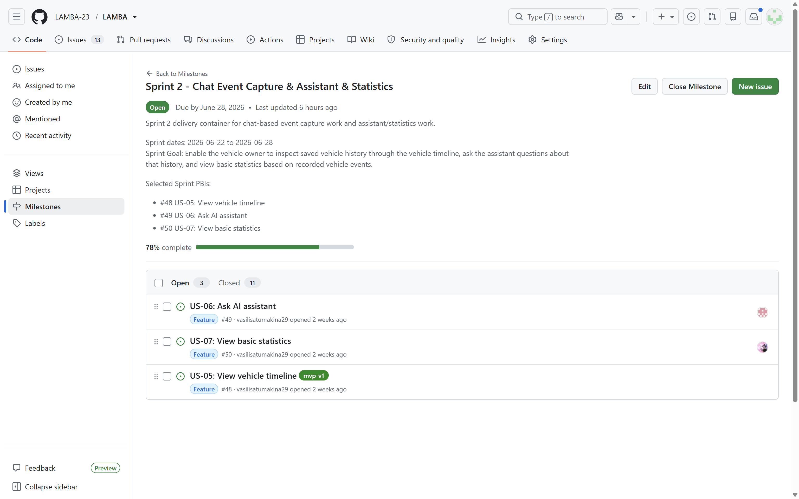 |
| Latest protected-default-branch CI run | 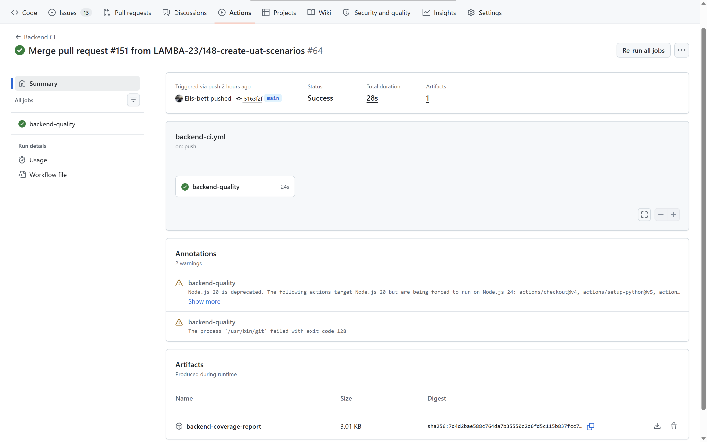 |
| Branch protection or rules evidence | 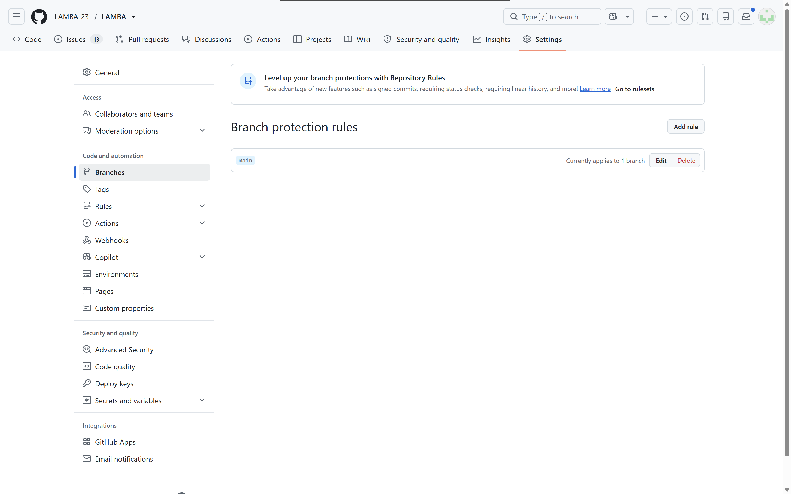 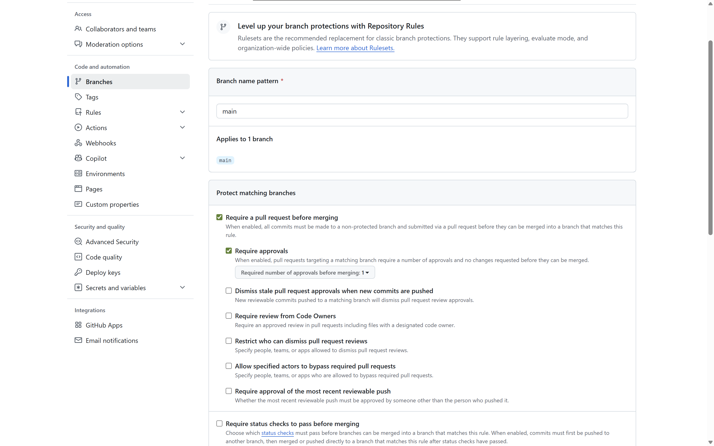 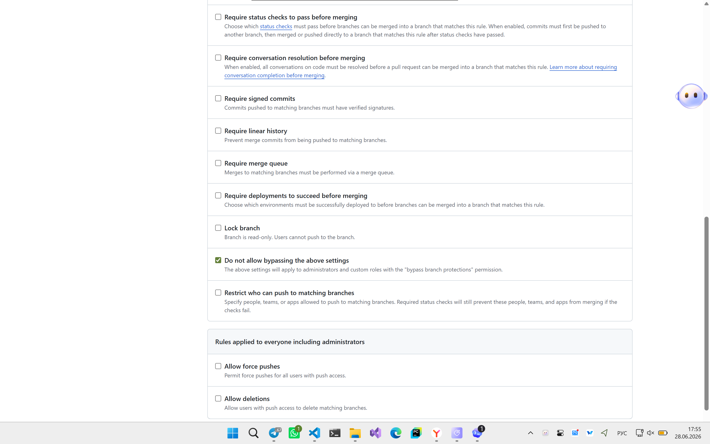 |
| Coverage or test report | 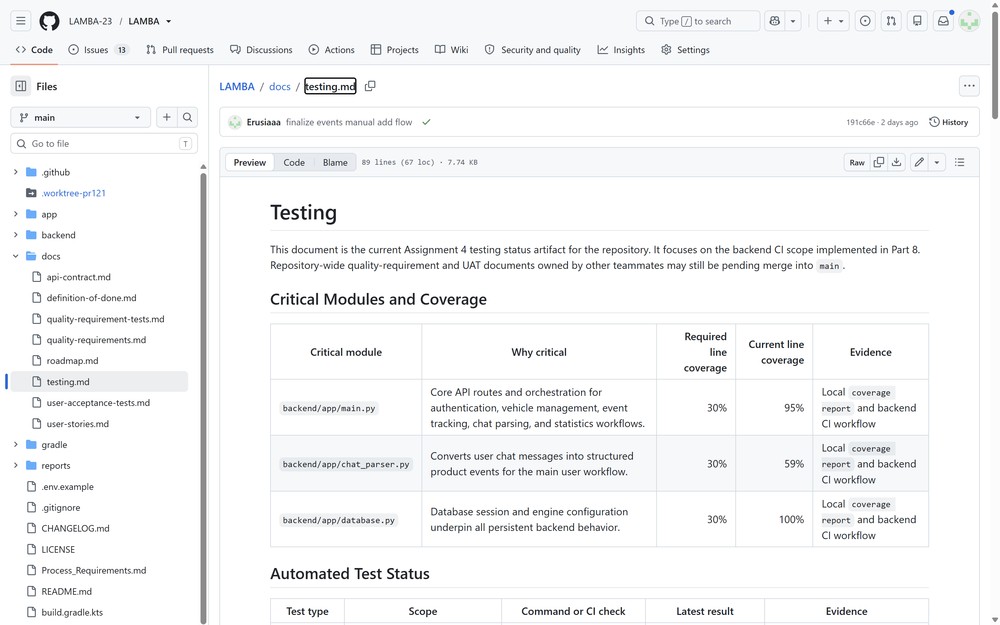 |
| Additional QA check result | 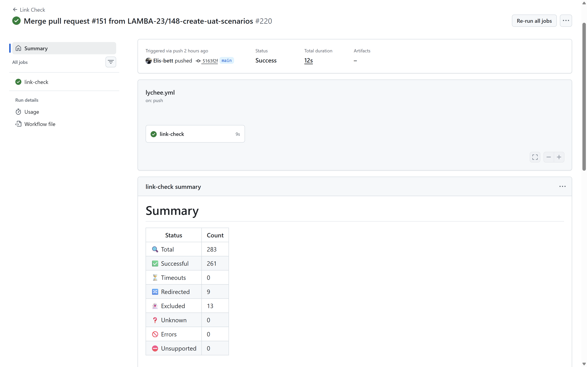 |
| SemVer release | 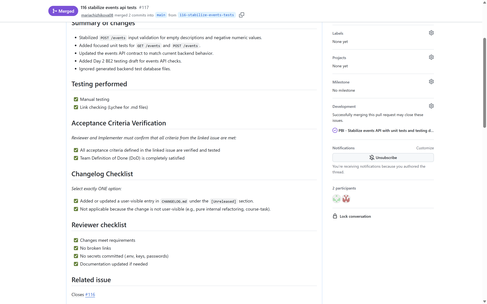 |
| Example reviewed issue-linked PR/MR | 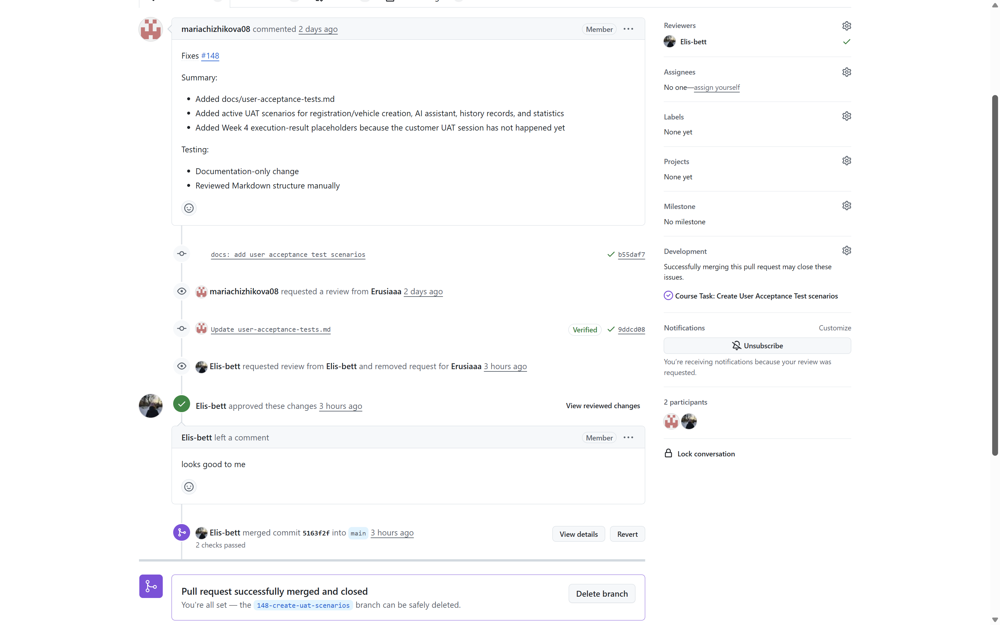 |
| Product Backlog screenshot, if public links may not be inspectable by graders | 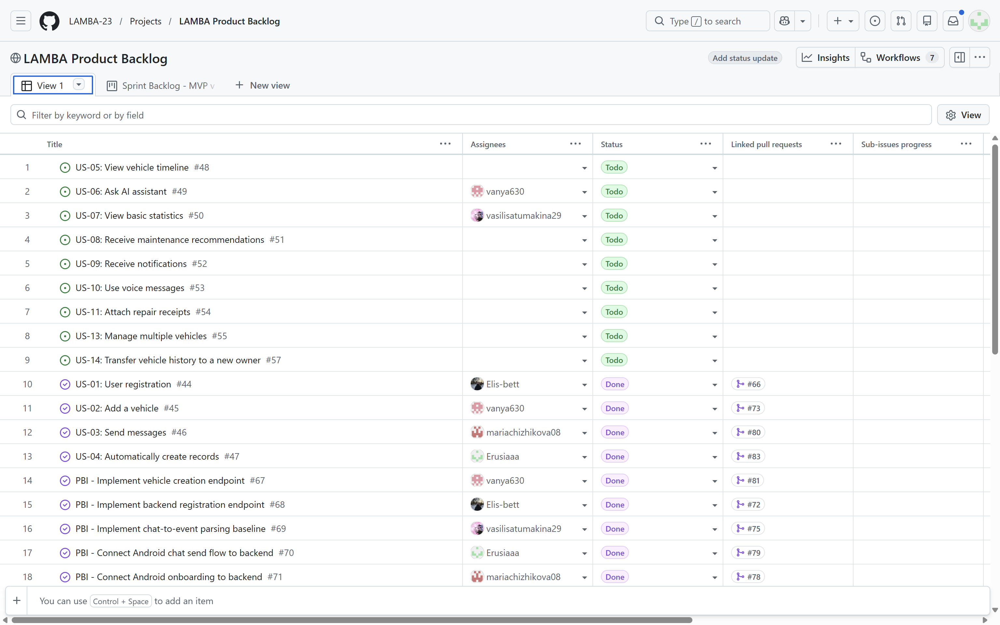 |
| Sprint Backlog screenshot, if public links may not be inspectable by graders | 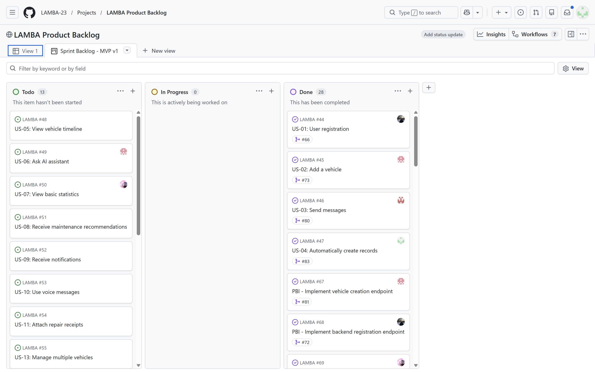 |
| Deployed product or runnable artifact screenshot, if public links may not be inspectable by graders | 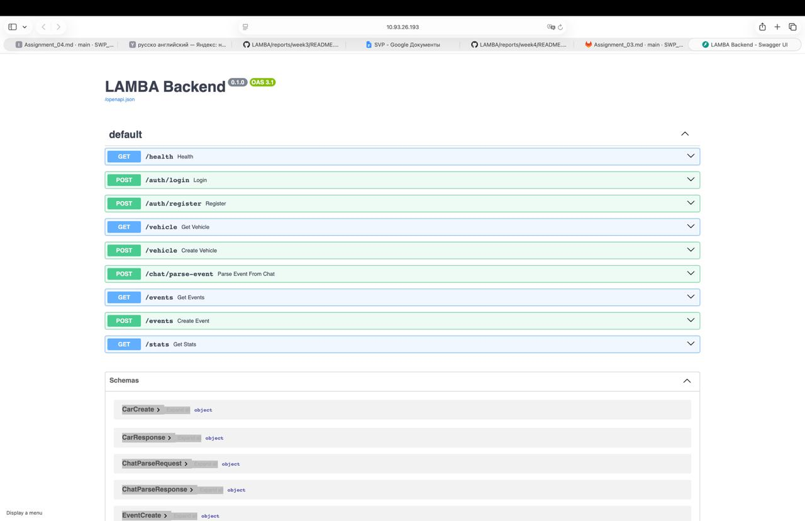 |

## Current Verification Evidence

The backend CI workflow was verified with the same command categories as the GitHub Actions job:

- `python -m ruff check backend/app backend/tests`
- `python -m ruff format --check backend/app backend/tests`
- `python -m coverage run -m pytest backend/tests`
- `python -m coverage report --include='backend/app/*'`
- `python -m pip check`

Current documented results:

- backend tests: `32 passed`
- backend total coverage: `89%`
- critical module coverage:
  - `backend/app/main.py`: `95%`
  - `backend/app/chat_parser.py`: `59%`
  - `backend/app/database.py`: `100%`
- dependency health check: `No broken requirements found`
