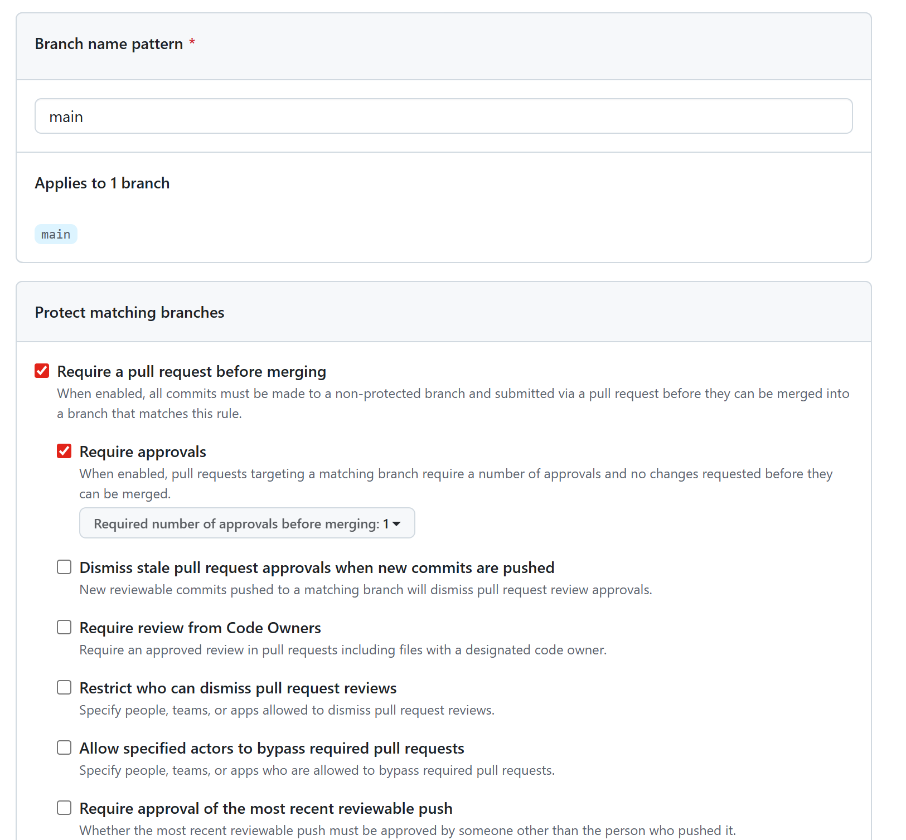

# Week 4 Report - CI and Quality Automation

This is the public Week 4 report section for Assignment 4 repository automation evidence. It documents the CI configuration work completed for Part 8 and the public evidence that must be included before submission.

## 1. Assignment scope

- Assignment/week: Week 4 / Assignment 4
- Part covered here: Part 8 - Configure CI
- Related issue: [#135](https://github.com/LAMBA-23/LAMBA/issues/135)
- Related branch: `135-configure-backend-ci`

## 2. CI configuration evidence

- Backend CI workflow: [`.github/workflows/backend-ci.yml`](../../.github/workflows/backend-ci.yml)
- Link-check workflow: [`.github/workflows/lychee.yml`](../../.github/workflows/lychee.yml)
- Testing status artifact: [`docs/testing.md`](../../docs/testing.md)
- Definition of Done update: [`docs/definition-of-done.md`](../../docs/definition-of-done.md)

## 3. Required CI links

Add the public GitHub Actions links here after pushing the branch and getting the first successful runs:

- Pull request CI run: `TODO after PR creation`
- Latest `main` backend CI run: `TODO after merge or protected-branch run`
- Latest `main` Lychee run: `TODO before final submission`

## 4. Branch protection or rules evidence

The report must include inspectable evidence that the protected default branch enforces the required review workflow.

- Existing branch protection screenshot from Week 2: [`reports/week2/images/branch-protection-rule.png`](../week2/images/branch-protection-rule.png)
- Recommended Week 4 evidence: add a fresh screenshot from the repository branch protection or rules settings if anything changed since Week 2

### Embedded branch protection evidence

## 5. Testing-report screenshots

The Week 4 public report must include screenshots showing the testing status evidence.

Recommended screenshots:

- `docs/testing.md` critical modules and coverage table
- `docs/testing.md` CI and QA status table
- Successful GitHub Actions `Backend CI` run
- Successful GitHub Actions `Link Check` run

Place the screenshots under `reports/week4/images/` and embed them here.

### Screenshot placeholders

- `TODO`: add `reports/week4/images/testing-report-coverage.png`
- `TODO`: add `reports/week4/images/testing-report-ci-status.png`
- `TODO`: add `reports/week4/images/backend-ci-success.png`
- `TODO`: add `reports/week4/images/lychee-success.png`

## 6. Current local verification evidence

The backend CI workflow was verified locally before push using the same command categories as the GitHub Actions job:

- `python -m ruff check backend/app backend/tests`
- `python -m ruff format --check backend/app backend/tests`
- `python -m coverage run -m pytest backend/tests`
- `python -m coverage report --include='backend/app/*'`
- `python -m pip check`

Current local results:

- backend tests: `47 passed`
- backend total coverage: `89%`
- critical module coverage:
  - `backend/app/main.py`: `95%`
  - `backend/app/chat_parser.py`: `59%`
  - `backend/app/database.py`: `100%`
- dependency health check: `No broken requirements found`

## 7. Remaining submission actions

Before final Week 4 submission, replace the `TODO` placeholders in this report with:

1. Real GitHub Actions run links
2. Fresh screenshots from the successful CI runs
3. Branch protection or rules evidence that matches the current repository settings
4. Any updated evidence from teammate-owned Assignment 4 documents once their PRs are merged

## 15. Link to docs/quality-requirement-tests.md

- [docs/quality-requirement-tests.md](../../docs/quality-requirement-tests.md)

## 16. Link to docs/testing.md

- [docs/testing.md](../../docs/testing.md)

## 17. Link to docs/user-acceptance-tests.md

- [docs/user-acceptance-tests.md](../../docs/user-acceptance-tests.md)

## 18. Summary of the quality model used and selected ISO/IEC 25010 sub-characteristics

The team used ISO/IEC 25010 as the quality model for Assignment 4 and selected sub-characteristics that match the current MVP risk profile:

| Quality requirement | ISO/IEC 25010 sub-characteristic | Reason |
| --- | --- | --- |
| QR-001 — Vehicle event data integrity | Integrity | Invalid event records must not corrupt the vehicle timeline, mileage, cost, or maintenance history. |
| QR-002 — Timeline API response time | Time behaviour | Timeline access is a core user workflow and should remain responsive under normal backend operation. |
| QR-003 — Backend regression testability | Testability | The backend is changing quickly, so regression tests must make future changes safer before merge. |

- [docs/quality-requirements.md](../../docs/quality-requirements.md)
- [docs/quality-requirement-tests.md](../../docs/quality-requirement-tests.md)

## 19. Testing status summary

Current documented backend verification status:

- backend tests: `47 passed`
- backend total line coverage: `89%`
- minimum required line coverage for critical modules: `30%`
- additional QA check: `python -m pip check`, result `No broken requirements found`

| Critical module | Role | Required line coverage | Current line coverage | Status |
| --- | --- | ---: | ---: | --- |
| `backend/app/main.py` | Core API routes and orchestration for auth, vehicles, events, chat, and statistics | 30% | 95% | Pass |
| `backend/app/chat_parser.py` | Converts vehicle chat messages into structured events | 30% | 59% | Pass |
| `backend/app/database.py` | Database session and engine configuration | 30% | 100% | Pass |

- [docs/testing.md](../../docs/testing.md)

## 20. Links to unit tests

Backend unit and focused behavior tests:

- [backend/tests/test_auth.py](../../backend/tests/test_auth.py)
- [backend/tests/test_chat_parser.py](../../backend/tests/test_chat_parser.py)
- [backend/tests/test_deepseek_chat.py](../../backend/tests/test_deepseek_chat.py)
- [backend/tests/test_quality_requirements.py](../../backend/tests/test_quality_requirements.py)

Android unit test:

- [app/src/test/java/com/lamba/app/network/ChatRepositoryTest.kt](../../app/src/test/java/com/lamba/app/network/ChatRepositoryTest.kt)

## 21. Links to integration tests

Integration-style backend API tests use FastAPI `TestClient` with SQLite-backed persistence:

- [backend/tests/test_chat_ask.py](../../backend/tests/test_chat_ask.py)
- [backend/tests/test_chat_parse.py](../../backend/tests/test_chat_parse.py)
- [backend/tests/test_events.py](../../backend/tests/test_events.py)
- [backend/tests/test_stats.py](../../backend/tests/test_stats.py)
- [backend/tests/test_vehicle.py](../../backend/tests/test_vehicle.py)
- [backend/tests/conftest.py](../../backend/tests/conftest.py)

## 22. Links to automated quality requirement tests

Automated QRTs are implemented in:

- [backend/tests/test_quality_requirements.py](../../backend/tests/test_quality_requirements.py)

Traceability:

| QRT | Requirement | Automated evidence |
| --- | --- | --- |
| QRT-001 | Vehicle event data integrity | Invalid event type, empty description, negative amount, negative mileage, and unknown user are rejected and not persisted. |
| QRT-002 | Timeline API response time | `GET /events` responds within 2 seconds under the documented test dataset. |
| QRT-003 | Backend regression testability | The full backend pytest suite is enforced by CI before merge. |

- [docs/quality-requirement-tests.md](../../docs/quality-requirement-tests.md)

## 23. Link to the CI pipeline

- [Backend CI workflow](../../.github/workflows/backend-ci.yml)
- [Link Check workflow](../../.github/workflows/lychee.yml)
- [GitHub Actions — all workflows](https://github.com/LAMBA-23/LAMBA/actions)

## 24. Link to the latest protected-default-branch CI run

- Backend CI run: https://github.com/LAMBA-23/LAMBA/actions (Backend CI workflow)
- Link Check run: https://github.com/LAMBA-23/LAMBA/actions (Lychee workflow)

## 25. Branch protection or rules evidence for the protected default branch

The protected default branch is `main`.

Branch protection evidence:

| Rule | Status |
| --- | --- |
| Required pull request reviews | Enabled |
| Required approving review count | 1 |
| Enforce admins | Enabled |
| Force pushes | Disabled |
| Branch deletions | Disabled |

Evidence links:

- [Protected branch: main](https://github.com/LAMBA-23/LAMBA/tree/main)
- [Repository branches](https://github.com/LAMBA-23/LAMBA/branches)
- Branch protection screenshot: [reports/week2/images/branch-protection-rule.png](../week2/images/branch-protection-rule.png)

## 26. Screenshots or report links for linting, coverage, tests, and the additional QA check

| Evidence type | Report or screenshot link | Status |
| --- | --- | --- |
| Linting | [Backend CI workflow](../../.github/workflows/backend-ci.yml) | Passing |
| Formatting | [Backend CI workflow](../../.github/workflows/backend-ci.yml) | Passing |
| Automated tests | [Backend CI workflow](../../.github/workflows/backend-ci.yml), [docs/testing.md](../../docs/testing.md) | Passing |
| Coverage | [Backend CI workflow](../../.github/workflows/backend-ci.yml), [docs/testing.md](../../docs/testing.md) | 89% total backend coverage |
| Additional QA check | `python -m pip check` in [Backend CI](../../.github/workflows/backend-ci.yml) | Passing |
| Markdown link check | [Link Check workflow](../../.github/workflows/lychee.yml) | Passing |

Screenshot files should be placed in [`reports/week4/images/`](images/).

## 27. How Assignment 4 quality controls govern later work

Assignment 4 turns quality evidence into a continuing project gate. Future PBIs may be marked `Done` only when their acceptance criteria are verified, relevant tests pass, applicable automated quality requirement tests pass, CI is green, and evidence remains traceable through issues, PRs, CI runs, coverage reports, or maintained documentation.

The current Definition of Done requires:

- passing CI checks before merge;
- relevant automated unit and integration tests;
- applicable automated quality requirement tests;
- coverage expectations for critical modules from [docs/testing.md](../../docs/testing.md);
- preserved testing and review evidence;
- documentation and changelog updates when needed;
- no committed secrets or prohibited private artifacts.

This means later work on AI answers, manual history entry, authorization, password hashing, Android coverage, and release packaging must continue to satisfy the same CI, QRT, testing, and review standards.

- [docs/definition-of-done.md](../../docs/definition-of-done.md)
- [docs/testing.md](../../docs/testing.md)
- [docs/quality-requirement-tests.md](../../docs/quality-requirement-tests.md)

## 28. Link to the SemVer release mapped to the Assignment 4 Sprint increment

- [v0.1.0 — MVP v1 Foundation](https://github.com/LAMBA-23/LAMBA/releases/tag/v0.1.0)

This SemVer release is the current public release artifact available for the Assignment 4 Sprint increment. The release is mapped to the MVP v1 foundation and remains the latest GitHub release at the time of this Week 4 report.
