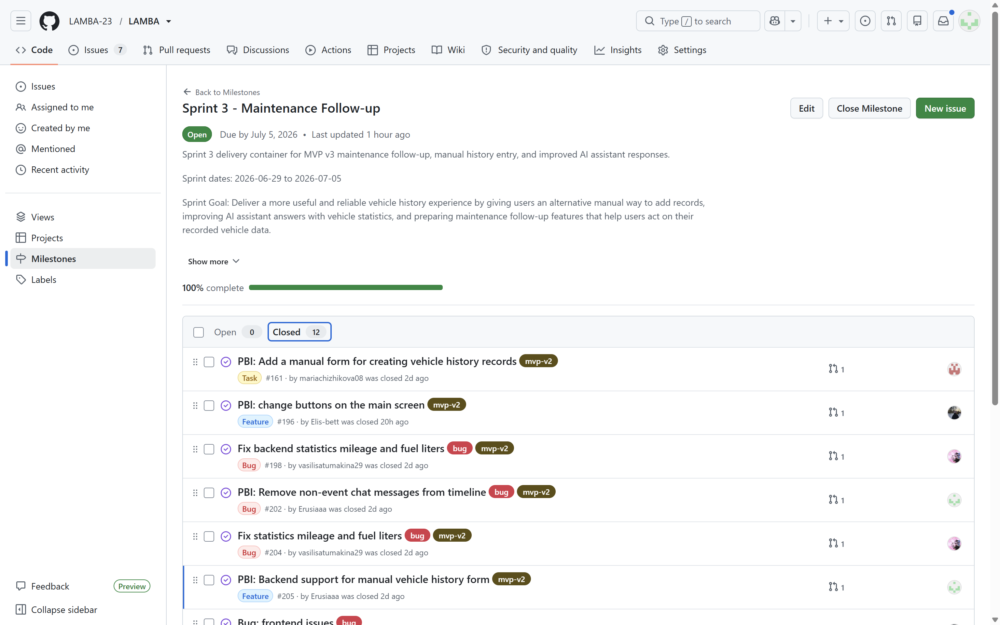
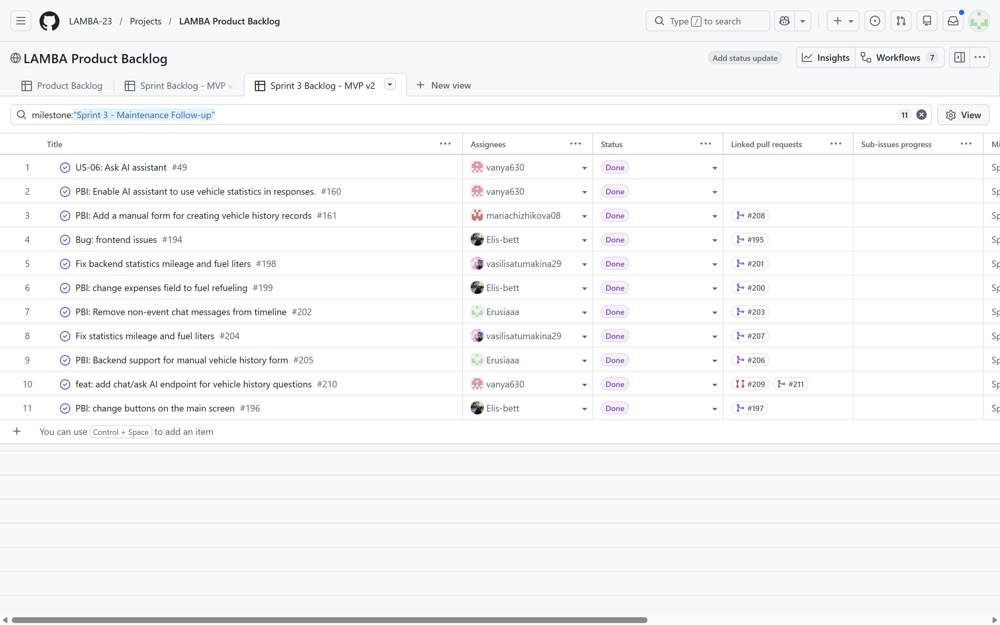
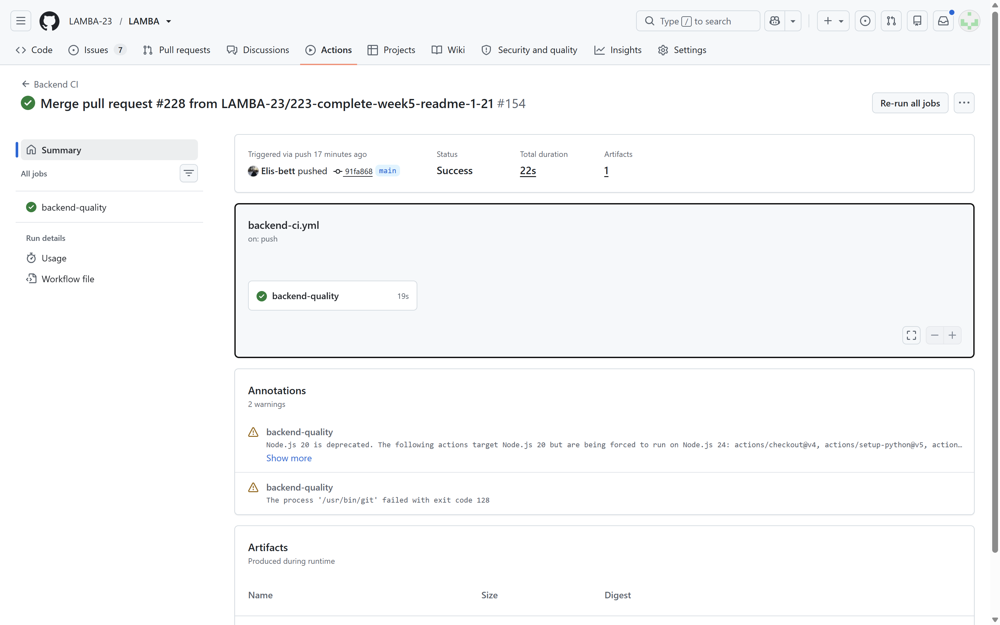
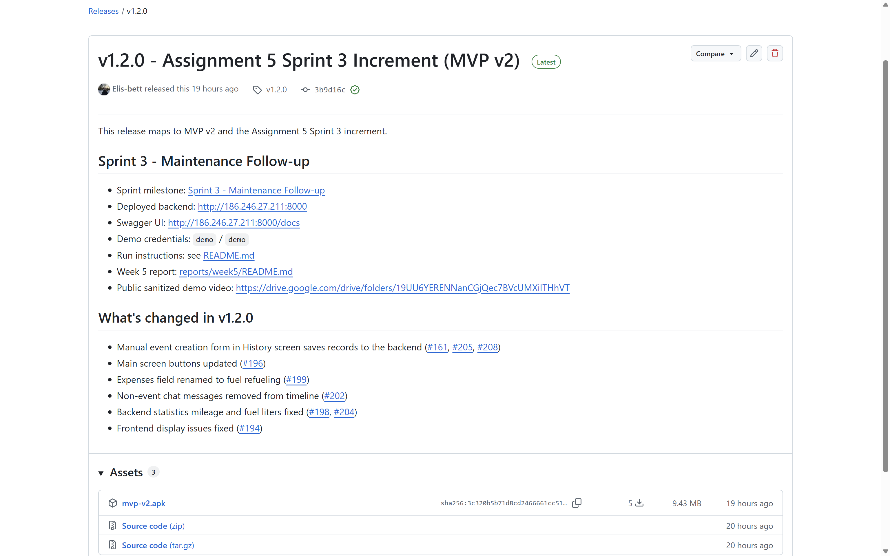
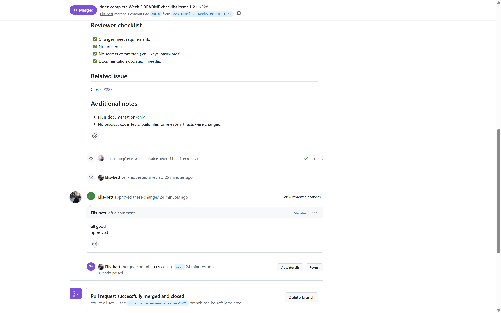
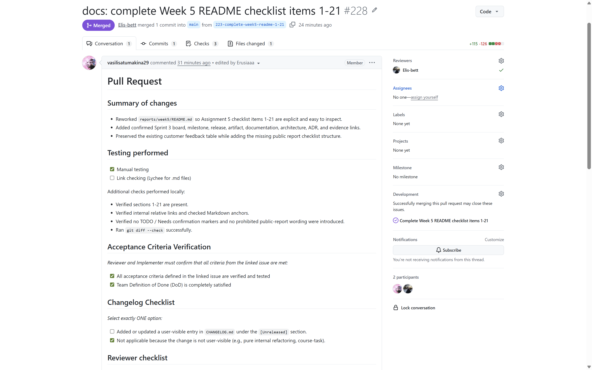
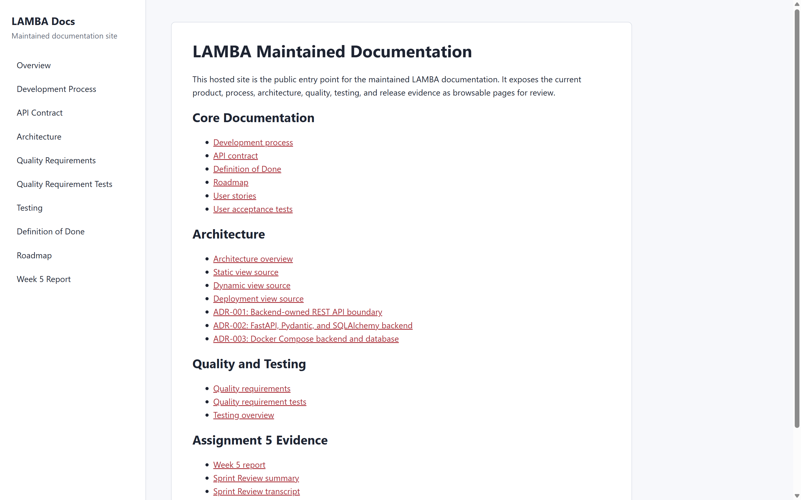

# Week 5 Report

## 1. Project name and short description

**LAMBA** is an Android application for creating a digital twin of a car. It lets a vehicle owner register, add a vehicle profile, record vehicle events through chat or a manual form, inspect the vehicle timeline, and view vehicle statistics.

## 2. Product Backlog board/view

- [Product Backlog board](https://github.com/orgs/LAMBA-23/projects/1)

## 3. Sprint Backlog board/table

- [Sprint Backlog board/table](https://github.com/orgs/LAMBA-23/projects/1/views/4)

## 4. Assignment 5 Sprint milestone

- [Sprint 3 - Maintenance Follow-up](https://github.com/LAMBA-23/LAMBA/milestone/3)

## 5. Sprint Goal, Sprint dates, and short scope summary

**Sprint dates:** 2026-06-29 to 2026-07-05

**Sprint Goal:** Deliver a more useful and reliable vehicle history experience by giving users an alternative manual way to add records, improving assistant answers with vehicle statistics, and preparing maintenance follow-up features that help users act on their recorded vehicle data.

**Scope summary:** Sprint 3 focused on MVP v2 maintenance follow-up: manual history record creation, statistics fixes, cleaner timeline behavior, main screen usability updates, assistant statistics support, release evidence, architecture documentation, and Week 5 review/UAT evidence.

## 6. Total Sprint size in Story Points

The total Sprint 3 issue size is **43 Story Points**.

Closed Sprint issues counted in the total:

| Issue | Story Points |
|---|---:|
| [#49](https://github.com/LAMBA-23/LAMBA/issues/49) | 5 |
| [#160](https://github.com/LAMBA-23/LAMBA/issues/160) | 3 |
| [#161](https://github.com/LAMBA-23/LAMBA/issues/161) | 5 |
| [#194](https://github.com/LAMBA-23/LAMBA/issues/194) | 2 |
| [#196](https://github.com/LAMBA-23/LAMBA/issues/196) | 2 |
| [#198](https://github.com/LAMBA-23/LAMBA/issues/198) | 5 |
| [#199](https://github.com/LAMBA-23/LAMBA/issues/199) | 2 |
| [#202](https://github.com/LAMBA-23/LAMBA/issues/202) | 3 |
| [#204](https://github.com/LAMBA-23/LAMBA/issues/204) | 5 |
| [#205](https://github.com/LAMBA-23/LAMBA/issues/205) | 3 |
| [#210](https://github.com/LAMBA-23/LAMBA/issues/210) | 5 |
| [#212](https://github.com/LAMBA-23/LAMBA/issues/212) | 3 |

Total: `5 + 3 + 5 + 2 + 2 + 5 + 2 + 3 + 5 + 3 + 5 + 3 = 43 SP`.

## 7. Summary of delivered product changes

During Week 5 / Assignment 5, the team delivered the Sprint 3 MVP v2 increment:

- added an Android manual history record creation form for fuel, repair, maintenance, and trip records;
- added backend support for manual vehicle history records through the existing event model;
- fixed mileage, fuel liters, expense, period, and record-count behavior in statistics;
- connected chat questions to vehicle-history answers through the backend question endpoint;
- removed non-event chat messages from the timeline so the history view stays focused on vehicle records;
- updated main screen actions and frontend layout behavior for better usability;
- published `v1.2.0` with an Android APK artifact and maintained release evidence;
- added maintained architecture, ADR, quality, testing, UAT, Sprint Review, retrospective, reflection, and documentation-site evidence.

The following planned items were not completed and remain backlog or follow-up work:

| Issue | Reason |
|---|---|
| [#51](https://github.com/LAMBA-23/LAMBA/issues/51) | Maintenance recommendations were deferred until core data-entry and statistics gaps are stable. |
| [#52](https://github.com/LAMBA-23/LAMBA/issues/52) | Notifications depend on stable recommendation behavior and were deferred. |

## 8. Link to deployed product, hosted artifact, package, or runnable product

Current public access artifacts for the Assignment 5 Sprint increment:

- [GitHub Release: v1.2.0 - Assignment 5 Sprint 3 Increment (MVP v2)](https://github.com/LAMBA-23/LAMBA/releases/tag/v1.2.0)
- [Android APK asset: mvp-v2.apk](https://github.com/LAMBA-23/LAMBA/releases/download/v1.2.0/mvp-v2.apk)
- [Hosted maintained documentation site](https://lamba-23.github.io/LAMBA/)
- [Documentation-site task #221](https://github.com/LAMBA-23/LAMBA/issues/221)
- [Deployed backend Swagger UI](http://186.246.27.211:8000/docs)
- Deployed backend API base host: `186.246.27.211:8000`
- Public sanitized demo video: https://drive.google.com/drive/folders/19UU6YERENNanCGjQec7BVcUMXiITHhVT
- [Runnable backend source: docker-compose.yml](../../docker-compose.yml)

## 9. Link to current access or run instructions

- [Root README - Local Setup](../../README.md#local-setup)
- [Root README - Assignment 5 Sprint Increment Release](../../README.md#assignment-5-sprint-increment-release)
- [Root README - Runnable Artifact](../../README.md#runnable-artifact)

## 10. Customer feedback response table

We reviewed the feedback from the MVP v1 customer review and recorded what we did with each important point. If we did not take something into Sprint 3, we still wrote down why.

| Feedback point | Resulting PBI or issue | Status | Response |
|---|---|---|---|
| Passwords should not stay as plain text. | Security hardening PBI for password hashing. | Added to the backlog for later | We agree this is important, but Sprint 3 focused first on stabilizing the main product flow and release evidence. |
| Backend should return data for the current user, not shared demo data. | [#44](https://github.com/LAMBA-23/LAMBA/issues/44), [#67](https://github.com/LAMBA-23/LAMBA/issues/67), [#68](https://github.com/LAMBA-23/LAMBA/issues/68), [#71](https://github.com/LAMBA-23/LAMBA/issues/71) | Partially addressed | Registration, vehicle, and event data now use the selected user. Full token-based authorization is still future work. |
| The user should stay logged in if possible. | [#71](https://github.com/LAMBA-23/LAMBA/issues/71) | Addressed in the Sprint | Added local session persistence in the Android app. |
| Vehicle registration should happen after user registration. | [#45](https://github.com/LAMBA-23/LAMBA/issues/45), [#67](https://github.com/LAMBA-23/LAMBA/issues/67), [#71](https://github.com/LAMBA-23/LAMBA/issues/71) | Addressed in the Sprint | Added vehicle setup after registration/onboarding. |
| Vehicle brand, model, year, and mileage should be stored. | [#45](https://github.com/LAMBA-23/LAMBA/issues/45), [#67](https://github.com/LAMBA-23/LAMBA/issues/67) | Addressed in the Sprint | Added these fields to the vehicle profile flow. |
| Basic chat should be included in MVP v1. | [#46](https://github.com/LAMBA-23/LAMBA/issues/46), [#69](https://github.com/LAMBA-23/LAMBA/issues/69), [#70](https://github.com/LAMBA-23/LAMBA/issues/70) | Addressed in the Sprint | Added chat messages, backend parsing, and assistant responses. |
| AI should ask clarification questions when it cannot understand the message. | [#69](https://github.com/LAMBA-23/LAMBA/issues/69), [#70](https://github.com/LAMBA-23/LAMBA/issues/70) | Partially addressed | Added basic clarification responses. Long-term dialog memory is not done yet. |
| AI should later support statistics, summaries, routes, fuel, and repairs. | [#47](https://github.com/LAMBA-23/LAMBA/issues/47), [#49](https://github.com/LAMBA-23/LAMBA/issues/49), [#50](https://github.com/LAMBA-23/LAMBA/issues/50) | Partially addressed | Basic event parsing was started. Statistics and summaries are planned for later PBIs. |
| Chat could redirect to pre-filled repair/fuel/trip forms. | Future chat-to-timeline PBI. | Rejected or deferred with rationale | We postponed this because the timeline and event flow should be stable first. |
| Vehicle photo upload could be added later. | Future optional media PBI. | Added to the backlog for later | This was mentioned as future scope, not MVP v2 priority. |
| Achievements could be added later. | Future optional achievements PBI. | Added to the backlog for later | This is lower priority than core product flow and quality risks. |
| Customer needs a way to inspect the product despite deployment limits. | Release evidence and video demo. | Partially addressed | We used a video demo as fallback and kept release/deployment access as a risk to track. |

Sprint 3 scope was chosen not just by the number of issues we could close, but by customer value, quality improvement, risk reduction, and whether the work could be shown as Done.

## 11. Explanation of feedback not addressed

- **Password hashing and token-based authorization:** deferred because Sprint 3 focused on product-flow stabilization, release evidence, and customer-visible MVP v2 improvements. This remains a security hardening follow-up.
- **Long-term dialog memory and broader AI summaries/routes/fuel/repair support:** partially addressed through baseline parsing, statistics, and assistant work, but not completed as full product behavior.
- **Chat-to-prefilled-form redirect:** deferred because the timeline, manual entry, and event flow needed to be stable before adding a confirmation/redirect workflow.
- **Vehicle photo upload:** kept as later optional media scope, not an MVP v2 priority.
- **Achievements:** kept as later engagement scope because it is lower priority than core vehicle-history and quality risks.
- **Product access limitations:** partially handled through release evidence, APK, deployed backend/Swagger, documentation site, and sanitized demo video, with realistic APK testing still listed as follow-up in the Sprint Review.

## 12. Link to docs/roadmap.md

- [docs/roadmap.md](../../docs/roadmap.md)

## 13. Link to docs/definition-of-done.md

- [docs/definition-of-done.md](../../docs/definition-of-done.md)

## 14. Link to docs/testing.md

- [docs/testing.md](../../docs/testing.md)

## 15. Link to docs/quality-requirements.md

- [docs/quality-requirements.md](../../docs/quality-requirements.md)

## 16. Link to docs/quality-requirement-tests.md

- [docs/quality-requirement-tests.md](../../docs/quality-requirement-tests.md)

## 17. Link to docs/user-acceptance-tests.md

- [docs/user-acceptance-tests.md](../../docs/user-acceptance-tests.md)

## 18. Link to docs/development-process.md

- [docs/development-process.md](../../docs/development-process.md)

## 19. Link to docs/architecture/README.md

- [docs/architecture/README.md](../../docs/architecture/README.md)

## 20. Links to the static, dynamic, and deployment view artifacts

- [Static view: component diagram](../../docs/architecture/static-view/component-diagram.puml)
- [Dynamic view: chat event sequence](../../docs/architecture/dynamic-view/chat-event-sequence.puml)
- [Deployment view: deployment diagram](../../docs/architecture/deployment-view/deployment-diagram.puml)

## 21. Link to the ADR directory or ADR index

- [ADR directory](../../docs/architecture/adr/)
- [ADR index in architecture README](../../docs/architecture/README.md#architecture-decision-records)

## 22. Summary of the architecture and how it supports the current product

LAMBA is structured as a mobile-first system with a Kotlin Android client, a FastAPI backend, PostgreSQL persistence, and an optional external AI service boundary. The Android app owns user interaction and navigation. The backend owns validation, event creation, vehicle data, statistics calculations, and AI-related API boundaries. PostgreSQL stores the durable vehicle, user, and event state used by the timeline, manual form, statistics, and assistant flows.

This architecture supports the current MVP v2 product because the most important user-facing behavior depends on reliable vehicle-history data. Manual form submissions, chat-parsed records, timeline display, and statistics all pass through the backend event model instead of being calculated independently on the client. This keeps data rules centralized and makes the current product easier to test and maintain.

The deployment view documents the current runnable shape: Android app or emulator, Docker Compose backend host, FastAPI container, PostgreSQL container and volume, and external Timeweb AI API where configured.

## 23. How quality requirements are linked to architecture decisions

Quality requirements are linked to ADRs in [docs/quality-requirements.md](../../docs/quality-requirements.md#architecture-decision-traceability) and summarized in the [architecture ADR index](../../docs/architecture/README.md#architecture-decision-records).

- QR-001, QR-002, and QR-003 are linked to [ADR-001](../../docs/architecture/adr/001-use-backend-owned-rest-api-boundary.md), [ADR-002](../../docs/architecture/adr/002-use-fastapi-pydantic-sqlalchemy-backend.md), and [ADR-003](../../docs/architecture/adr/003-use-docker-compose-for-backend-and-database.md) because data integrity, response time, and regression testing depend on the Android-to-backend API boundary, backend validation/persistence, and reproducible deployment.
- QR-004 and QR-005 are linked mainly to ADR-001 and ADR-002 because assistant context correctness and statistics correctness depend on backend-owned API behavior and persisted vehicle history.
- QR-006 is linked to ADR-001, ADR-002, and ADR-003 because critical-module coverage and CI evidence protect the backend/API/deployment decisions that the MVP relies on.

## 24. Testing and CI status summary for the delivered increment

The delivered MVP v2 increment is covered by backend checks, Android CI, markdown link checking, documentation publishing evidence, and documented manual/UAT review evidence.

Latest protected-default-branch evidence for `main` commit `91fa868`:

- [Backend CI run](https://github.com/LAMBA-23/LAMBA/actions/runs/28744064308): success.
- [Android CI run](https://github.com/LAMBA-23/LAMBA/actions/runs/28744064309): success.
- [Link Check run](https://github.com/LAMBA-23/LAMBA/actions/runs/28744064312): success.
- [Latest successful Publish Documentation Site run](https://github.com/LAMBA-23/LAMBA/actions/runs/28742728850): success.

Testing evidence is also maintained in:

- [docs/testing.md](../../docs/testing.md)
- [docs/quality-requirement-tests.md](../../docs/quality-requirement-tests.md)
- [docs/user-acceptance-tests.md](../../docs/user-acceptance-tests.md)

## 25. Link to the CI pipeline

- [GitHub Actions CI pipeline](https://github.com/LAMBA-23/LAMBA/actions)
- [Backend CI workflow](../../.github/workflows/backend-ci.yml)
- [Android CI workflow](../../.github/workflows/android-ci.yml)
- [Link Check workflow](../../.github/workflows/lychee.yml)
- [Publish Documentation Site workflow](../../.github/workflows/pages.yml)

## 26. Link to the latest protected-default-branch CI run

- [Latest protected-default-branch Backend CI run for `main`](https://github.com/LAMBA-23/LAMBA/actions/runs/28744064308)

This run was triggered by a push to `main` for commit `91fa868` after PR #228 was merged.

## 27. Link to the SemVer release mapped to MVP v2

- [v1.2.0 - Assignment 5 Sprint 3 Increment (MVP v2)](https://github.com/LAMBA-23/LAMBA/releases/tag/v1.2.0)

## 28. Link to CHANGELOG.md

- [CHANGELOG.md](../../CHANGELOG.md)

## 29. Public sanitized demo video shorter than two minutes

- Public sanitized demo video: https://drive.google.com/drive/folders/19UU6YERENNanCGjQec7BVcUMXiITHhVT

## 30. Public sanitized UAT results summary

The public sanitized UAT results are documented in [docs/user-acceptance-tests.md](../../docs/user-acceptance-tests.md).

Week 5 executed UAT scenarios:

| UAT scenario | Result | Main feedback |
|---|---|---|
| UAT-005: Manually add a vehicle history record | Needs changes | Manual form direction was accepted, but follow-up work is needed for decimal fuel values, statistics synchronization, trip mileage input, repair/breakdown wording, photo attachments, and discoverability. |
| UAT-006: Ask the AI assistant about vehicle statistics | Needs changes | Assistant statistics answers improved, but follow-up work is needed for formatting, expense accuracy, recent breakdown queries, richer vehicle context, and more natural responses. |

## 31. Link to the hosted documentation site

- [LAMBA maintained documentation site](https://lamba-23.github.io/LAMBA/)

## 32. Link to the published Sprint Review transcript

- [Published sanitized Sprint Review transcript](./sprint-review-transcript.md)
- [Sprint Review summary](./sprint-review-summary.md)

The Sprint Review transcript is public and sanitized. Participant names are generalized as `Customer` and `Team member`.

## 33. Deviations from expected evidence or access arrangements

- Sprint Review and UAT public artifacts are sanitized. Private recording evidence is not published publicly; the repository provides the public transcript, public summary, and public UAT results summary instead.
- The demo video is provided through the public sanitized Drive evidence link used by the team for Assignment 5 review.
- The latest `Publish Documentation Site` run for `main` commit `91fa868` reached the GitHub Pages deploy step but failed with `Deployment failed, try again later`; the previous successful Pages run remains linked as publication evidence, and the hosted site is shown in the embedded screenshot below.
- Screenshots are included in this report because GitHub Projects, release pages, Actions runs, and hosted documentation pages may not always be inspectable in the same authenticated state by graders.

## 34. Link to reports/week5/sprint-review-summary.md

- [reports/week5/sprint-review-summary.md](./sprint-review-summary.md)

## 35. Link to reports/week5/reflection.md

- [reports/week5/reflection.md](./reflection.md)

## 36. Link to reports/week5/retrospective.md

- [reports/week5/retrospective.md](./retrospective.md)

## 37. Link to reports/week5/llm-report.md

- [reports/week5/llm-report.md](./llm-report.md)

## 38. Summary of the current product status

The MVP v2 increment is available as a reviewed Sprint 3 release with Android APK evidence, backend deployment evidence, hosted documentation, and public Sprint Review/UAT reporting. The product currently supports registration, vehicle profile setup, manual vehicle-history records, timeline display, statistics, and assistant questions about vehicle history/statistics.

The strongest completed areas are manual history entry, timeline cleanup, backend event/statistics fixes, architecture/ADR documentation, maintained quality evidence, and report traceability. The main remaining product gaps are AI answer quality, statistics edge cases found during UAT, chat-to-prefilled-form confirmation, recommendations, notifications, photo attachments, and more realistic APK validation.

## 39. Summary of the next steps

Recommended next steps from Sprint Review, UAT, and retrospective evidence:

1. Support decimal fuel liters in manual and chat-created refueling records.
2. Improve manual form to statistics synchronization and validate it end-to-end.
3. Improve AI statistics answer formatting, correctness, and vehicle context.
4. Add chat-to-prefilled-form confirmation before saving AI-parsed records.
5. Improve trip mileage input with start/end odometer values.
6. Rename or extend repair wording to include breakdowns.
7. Add optional photo attachments for history records.
8. Continue recommendations and notifications after data-entry and statistics behavior are stable.
9. Plan realistic APK-based UAT earlier in the next increment.

## 40. Contribution traceability table

| Team member | Issues / PRs / evidence | Contribution area |
|---|---|---|
| @Erusiaaa | [#187](https://github.com/LAMBA-23/LAMBA/pull/187), [#203](https://github.com/LAMBA-23/LAMBA/pull/203), [#206](https://github.com/LAMBA-23/LAMBA/pull/206), [#222](https://github.com/LAMBA-23/LAMBA/pull/222), [#202](https://github.com/LAMBA-23/LAMBA/issues/202), [#205](https://github.com/LAMBA-23/LAMBA/issues/205), [#221](https://github.com/LAMBA-23/LAMBA/issues/221) | Architecture views, timeline cleanup, backend manual form support, hosted documentation site, report evidence. |
| @mariachizhikova08 | [#191](https://github.com/LAMBA-23/LAMBA/pull/191), [#193](https://github.com/LAMBA-23/LAMBA/pull/193), [#208](https://github.com/LAMBA-23/LAMBA/pull/208), [#226](https://github.com/LAMBA-23/LAMBA/pull/226), [#161](https://github.com/LAMBA-23/LAMBA/issues/161), [#192](https://github.com/LAMBA-23/LAMBA/issues/192), [#224](https://github.com/LAMBA-23/LAMBA/issues/224) | Deployment diagram, ADRs, manual history form implementation, UAT documentation, review/merge activity. |
| @vasilisatumakina29 | [#181](https://github.com/LAMBA-23/LAMBA/pull/181), [#184](https://github.com/LAMBA-23/LAMBA/pull/184), [#201](https://github.com/LAMBA-23/LAMBA/pull/201), [#207](https://github.com/LAMBA-23/LAMBA/pull/207), [#215](https://github.com/LAMBA-23/LAMBA/pull/215), [#217](https://github.com/LAMBA-23/LAMBA/pull/217), [#227](https://github.com/LAMBA-23/LAMBA/pull/227), [#228](https://github.com/LAMBA-23/LAMBA/pull/228) | Roadmap, testing/quality evidence, statistics fixes, Sprint Review artifacts, retrospective, reflection, LLM report, Week 5 README checklist items 1-21. |
| @Elis-bett | [#185](https://github.com/LAMBA-23/LAMBA/pull/185), [#195](https://github.com/LAMBA-23/LAMBA/pull/195), [#197](https://github.com/LAMBA-23/LAMBA/pull/197), [#200](https://github.com/LAMBA-23/LAMBA/pull/200), [#219](https://github.com/LAMBA-23/LAMBA/pull/219), [review on #228](https://github.com/LAMBA-23/LAMBA/pull/228) | Customer feedback response, frontend fixes, main screen button design, expenses/fuel wording, release/report updates, PR review activity. |
| @vanya630 | [#189](https://github.com/LAMBA-23/LAMBA/pull/189), [#211](https://github.com/LAMBA-23/LAMBA/pull/211), [#210](https://github.com/LAMBA-23/LAMBA/issues/210) | Development process documentation, backend assistant question endpoint, AI/statistics support. |

## 41. Embedded screenshots from reports/week5/images/

### Sprint milestone

### Board or project workflow view

### Latest protected-default-branch CI run

### SemVer release

### Example reviewed issue-linked PR or MR

Additional overview screenshot for the same reviewed PR:

### Hosted docs site

## 42. Product access artifact screenshots where public links may not be inspectable

Product access and evidence links are public in the release/report sections above. To make the evidence inspectable even when external access differs for graders, this report embeds screenshots for the Sprint milestone, Project board, latest main CI run, SemVer release, reviewed issue-linked PR, and hosted documentation site in [reports/week5/images/](./images/).
